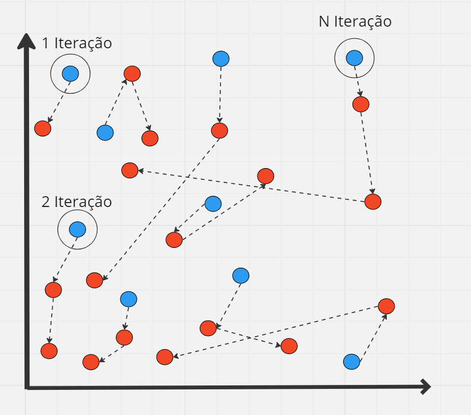

# Introdução

No cenário da indústria de telecomunicações, o crescimento exponencial da infraestrutura de telecomunicações na era da conectividade tem gerado uma crescente demanda por reparos e instalações de fibras ópticas, principalmente na construção de redes neutras, em todo o território brasileiro. "As redes neutras são aquelas nas quais várias operadoras atuam simultaneamente, utilizando a mesma infraestrutura"(HERMANO, 2022). Nesse contexto, um dos principais desafios enfrentados pelas empresas detentoras das redes neutras reside na otimização do roteamento dos técnicos encarregados dos processos de instalação e reparo. Este desafio assume uma dimensão crítica, uma vez que a capacidade de rotear eficientemente esses profissionais é relevante para garantir a eficiência operacional e, ao mesmo tempo, satisfazer a crescente demanda por serviços de conectividade de alta qualidade.

Nesse panorama dinâmico do setor de telecomunicações, o desafio de alocação eficiente de técnicos responsáveis por instalação e reparo nas redes neutras reflete uma instância de um problema de otimização bem estabelecido: o Vehicle Routing Problem (Problema de Roteamento de Veículos). O problema de roteamento de veículos (VRP) pode ser descrito como um "problema de programar uma frota de veículos para visitar um conjunto de clientes, a quem devem entregar ou de
quem eles devem coletar uma quantidade demandada de bens. O problema consiste em encontrar o melhor conjunto de rotas, de acordo com uma determinada função objetiva, de forma que todos as restrições operacionais dos veículos sejam respeitados e o conjunto de clientes seja abrangido"(MACEDO, 2011).

Além disso, é importante ressaltar que o VRP é notório por sua complexidade NP-Difícil (LENSTRA & RINNOOY, 1981). Isso implica que encontrar uma solução ótima para o VRP requer um esforço computacional significativo, o que torna as soluções exatas impraticáveis para instâncias de tamanho considerável. Portanto, nossa solução buscará uma maneira viável de realizar o roteamento dos funcionários, ou seja, determinar quais ordens (instalação/reparo) o técnico realizará no dia. Isso será alcançado através da aplicação de estratégias heurísticas e metaheurísticas, que permitirão a geração de rotas otimizadas. O objetivo principal é aprimorar a eficiência operacional da alocação de técnicos, alocando tarefas de forma mais inteligente, priorizando a proximidade geográfica e as demandas de serviço.

# Motivação

O roteamento de veículos figura como um dos principais desafios da indústria logística e de prestação de serviços. A diversidade de requisitos específicos de cada serviço, juntamente com as particularidades inerentes a diferentes indústrias, ressalta a necessidade premente de soluções robustas no domínio do roteamento de veículos.

No âmbito da Ciência da Computação, o problema de roteamento de veículos se revela como um campo vasto e dinâmico, onde a complexidade transcende a simples otimização de trajetos. As diversas ramificações desse problema complexo abordam detalhes específicos que permeiam desde restrições de tempo até limitações de capacidade, refletindo as demandas operacionais enfrentadas pela indústria e pelos serviços.

Entre essas ramificações, o Problema de Roteamento de Veículos com Múltiplos Depósitos (MDVRP) destaca-se como um ponto focal, desafiando a eficiência na coordenação de veículos provenientes de diversos pontos de origem. Essa variante não apenas reflete a realidade operacional de muitas empresas, mas também evidencia a necessidade de abordagens especializadas para aprimorar a eficiência logística.

Neste contexto, a busca por soluções inovadoras para o MDVRP não é apenas uma resposta aos desafios atuais, mas representa um compromisso com a evolução da logística. A compreensão aprofundada das ramificações do problema de roteamento de veículos, em particular o MDVRP, é essencial para desenvolver estratégias eficazes que possam não só resolver desafios operacionais de imediato, mas também moldar o futuro da otimização logística em um cenário em constante mudança.

# Metodologia

Para abordar o problema de Roteamento de Veículos com Múltiplos Depósitos, foram consideradas três estratégias distintas. Para facilitar a compreensão dessas abordagens, vamos ilustrar com um caso hipotético: imagine uma situação em que temos técnicos e atendimentos, onde os técnicos representam os depósitos e os atendimentos correspondem às demandas. Cada técnico possui seu próprio ponto de partida e precisa atender aos serviços, podendo se deslocar de um atendimento para outro. Nosso objetivo é aumentar a produtividade desses técnicos, fazendo com que eles consigam atender o maior número de demandas em uma distância total menor, respeitando as restrições.

Na primeira abordagem, a estratégia consistiu em utilizar o algoritmo KNN (K-nearest neighbors) para realizar uma clusterização dos atendimentos e técnicos, criando grupos em à distãncia. O KNN é estocástico e não determinístico, o que contribui para um resultado(clusterização) robusto (MOHAMMED, 2017). Após a aplicação do algoritmo do vizinho mais próximo, adotou-se a implementação de um algoritmo guloso, que seria responsável por realizar o roteamento dos técnicos para atender todas as demandas baseando-se nas distãncias euclidianas entre dois pontos.

Na segunda abordagem, foi adotado unicamente o algoritmo guloso. Diferentemente da clusterização, nessa abordagem, foi pensada a ideia de um plano cartesiano, onde o primeiro técnico cuja rota seria calculada seria aquele que aparecesse primeiro no eixo X do plano. Em outras palavras, o algoritmo guloso começaria uma varredura verticalmente, a partir do eixo X, onde os técnicos que estavam mais à esquerda no plano cartesiano seriam os primeiros escolhidos. A função do algoritmo guloso continuaria sendo calcular as rotas dos diferentes técnicos (identificados pela cor azul), mas agora utilizando uma matriz de tempo que representaria o tempo entre dois pontos, respeitando as diferenças físicas, como ruas, rodovias, trânsito e semáforos, de cada cidade.

---

A terceira abordagem é uma otimização da segunda. Nela, foi implementado junto com o algoritmo guloso, o algoritmo de busca local chamado Two Opt. Algoritmos de busca local constituem uma classe de algoritmos de aproximação que se baseiam na melhoria contínua de uma solução ao explorar seu entorno em busca de uma solução com custo mais baixo.(VERHOEVEN, 1995). No caso do Two opt, o algoritmo opera otimizando rotas ao trocar pares de arestas em uma solução, com o objetivo de encontrar uma solução viável que reduza o custo total(LIN & KERNIGHAN, 1973). Essa estratégia envolve identificar dois pontos na rota e inverter a ordem das arestas entre eles, potencialmente resultando em uma solução mais eficiente.

Por fim, a última abordagem adotada é uma otimização da terceira. Nela, foi proposta a ideia de implementar a heurística Large Neighborhood Search, que funcionaria da seguinte maneira.

- Identificar e selecionar uma grande vizinhança.
- Destruir ou "shaking" em uma parte da solução.
- Remover os vizinhos da solução.
- Recriar uma possível solução.
- Verificar se a nova solução é melhor que a antiga.
- Se não for, repetir até chegar a um resultado melhor.

No nosso caso, para identificar a vizinhança que vai ser destruída, escolhemos uma área baseando-se no funcionário que tenha a maior função objetivo e tenha percorrido uma grande distância. Após definir a área a ser destruída, removemos todos os nós, seja funcionário ou demanda, que se encontram dentro dessa área. Sem os nós dentro da área, utilizamos o algoritmo novamente, porém, apenas para essa região, e verificamos se o resultado atual é melhor que o anterior. Caso seja, paramos de destruir.

# Trabalhos relacionados

Existem diversos trabalhos relacionados ao problema de alocação e distribuição de equipes de técnicos. Alguns desses trabalhos abordam o problema de forma geral, enquanto outros se concentram em aspectos específicos, como a consideração de restrições de tempo ou a disponibilidade de recursos.

Um trabalho relevante é o artigo de Lenstra e Rinnooy Kan (1981), que analisa a complexidade do Problema de Roteamento de Veículos (VRP). O estudo revela que o VRP é NP-Difícil, indicando a dificuldade computacional em encontrar uma solução ótima. O artigo começa por definir o VRP como um problema de otimização que consiste em encontrar a melhor maneira de rotear uma frota de veículos para atender a um conjunto de demandas. O problema é definido por um conjunto de variáveis, incluindo: número de veículos, capacidade de cada veículo, localização das demandas, demanda de cada local. A constatação de Lenstra e Rinnooy sobre a NP-Dificuldade do VRP implica que a obtenção de soluções ótimas é computacionalmente desafiadora, especialmente para instâncias de grande porte, onde encontrar uma solução ideal em tempo razoável se torna impraticável. O estudo de Lenstra e Rinnooy possui relevância significativa para o projeto V.tal. Ao identificar a complexidade computacional na alocação e distribuição de equipes de técnicos, sugere-se que a abordagem do projeto V.tal deva priorizar soluções aproximadas. Para superar a dificuldade computacional, é recomendável explorar algoritmos heurísticos ou metaheurísticos que possam fornecer soluções aproximadas dentro de limites de tempo aceitáveis. Adicionalmente, o projeto V.tal deve incorporar considerações específicas, como a disponibilidade de técnicos e a distância entre as cidades, desenvolvendo um algoritmo capaz de encontrar soluções que atendam a essas restrições de forma eficiente.

Outro artigo relevante é o de Nabila Azi, Michel Gendreau e Jean-Yves Potvin (2010) que apresenta um algoritmo exato para resolver o problema de roteamento de veículos com janelas de tempo (VRPTW) e uso múltiplo de veículos. O VRPTW é um problema de otimização bem estudado que surge em muitas aplicações do mundo real, como entrega e transporte. O recurso de uso múltiplo de veículos adiciona uma camada adicional de complexidade ao problema, pois exige que o algoritmo considere a disponibilidade de veículos e a possibilidade de usá-los várias vezes no mesmo dia. O algoritmo é baseado em uma abordagem de programação dinâmica. A programação dinâmica é uma técnica para resolver problemas dividindo-os em subproblemas menores. O algoritmo primeiro constrói um conjunto de soluções viáveis para o problema e, em seguida, usa um procedimento de programação dinâmica para selecionar a melhor solução desse conjunto. O algoritmo é mostrado ser eficaz na obtenção de soluções ótimas para uma variedade de instâncias de VRPTW. O artigo é altamente pertinente para o projeto V.tal, pois aborda diretamente o desafio relacionado à alocação e distribuição estratégica de equipes de técnicos. O objetivo principal do projeto V.tal é efetuar a alocação otimizada de equipes para atender às demandas de instalação e reparo em diversas cidades. A contribuição central do artigo reside na apresentação de um algoritmo exato capaz de resolver eficientemente esse problema específico. Notavelmente, esse algoritmo é flexível e pode ser adaptado para atender às particularidades do projeto V.tal, como a disponibilidade variável de técnicos e as distâncias entre as cidades. Para exemplificar, o algoritmo pode ser ajustado considerando as especializações individuais dos técnicos, visando minimizar não apenas o tempo de deslocamento, mas também os custos operacionais associados. Além disso, ele pode ser personalizado para levar em conta as janelas de tempo disponíveis para as ordens de instalação e reparo, otimizando assim a eficiência operacional. Dessa forma, o artigo "An exact algorithm for a vehicle routing problem with time windows and multiple use of vehicles" representa uma valiosa adição ao escopo do projeto V.tal. Ao oferecer um algoritmo preciso e flexível, o artigo proporciona uma base sólida para resolver os desafios específicos relacionados à alocação e distribuição de equipes de técnicos no contexto do projeto V.tal.

 Já o artigo de Cagri KOCa1, Ismail KARAOGLANb (2011) contribui significativamente para a resolução do Problema de Roteamento de Veículos (VRP) em cenários de uso múltiplo de veículos. O algoritmo proposto utiliza a técnica Branch and Cut, que divide o problema em subproblemas menores, permitindo uma exploração eficiente do espaço de soluções. A peculiaridade do VRP com uso múltiplo de veículos adiciona complexidade, exigindo a consideração da capacidade dos veículos em múltiplos percursos, além da otimização do número total de veículos necessários. Ao abordar o desafio específico do uso múltiplo de veículos, o artigo fornece insights valiosos para o projeto V.tal. Dada a natureza dinâmica da força de trabalho de técnicos da V.tal, a reutilização eficiente de veículos pode ser crucial para otimizar rotas, reduzir custos operacionais e aprimorar os indicadores de serviço. Incluir este trabalho na revisão de literatura do projeto V.tal pode proporcionar uma abordagem avançada, adaptando e integrando conceitos do algoritmo para atender às nuances específicas do contexto da V.tal. Compreender profundamente a técnica Branch and Cut e sua aplicação ao VRP com uso múltiplo de veículos pode orientar o desenvolvimento de soluções inovadoras para os desafios enfrentados pela V.Tal no roteamento eficiente de suas equipes de técnicos.

Por fim, ao abordar a questão da alocação de frota, o artigo de Felipe Soares Tiburcio, Márcio Alexandre Lopes Júnior, Christiane Wenck Nogueira Fernandes e Silvia Lopes de Sena Taglialenha (2019), da Universidade Federal de Santa Catarina, concentra-se na alocação eficiente da frota de uma empresa de transporte público urbano em uma linha específica. O objetivo principal é reduzir o tempo ocioso dos veículos entre as viagens e estimar a frota mínima necessária. O artigo aborda a caracterização do problema, sua modelagem matemática e propõe uma solução utilizando um método exato, diferenciando-se da abordagem comum que geralmente recorre a métodos heurísticos. A pesquisa destaca a aplicação da programação matemática, mais especificamente o método de fluxo de custo mínimo, para resolver o problema operacional de alocação de frotas em uma linha de ônibus, apresentando resultados que indicam a utilização otimizada de veículos e a minimização dos custos associados à ociosidade temporal. Embora esse estudo não esteja diretamente relacionado ao contexto da V.tal, ele oferece insights valiosos sobre a eficiência na alocação de recursos, um aspecto crucial para o projeto V.tal ao lidar com a alocação estratégica de equipes de técnicos em diversas localidades.

# Descrição dos algoritmos adotados para resolver o problema

Dentre as quatros abordagens apresentadas na Metodologia, prosseguimos com a quarta: Algoritmo Guloso com Two Opt e Large Neighborhood Search.

Um algoritmo guloso é aquele que faz uma sequência de escolhas, sendo que cada escolha é, de alguma forma, a melhor disponível naquele momento (o termo "guloso" refere-se a escolher o melhor). Ao fazer a sequência de escolhas, um algoritmo guloso nunca retrocede em decisões anteriores (CURTIS, 2003). Portanto, na solução, o algoritmo guloso se basearia no menor tempo entre dois pontos.

Além disso, o algoritmo de busca local Two Opt opera da seguinte maneira: após o algoritmo guloso determinar as rotas iniciais para todos os técnicos, o Two Opt escolhe aleatoriamente um técnico e verifica todos os atendimentos atribuídos a esse funcionário. Ele realiza trocas entre essas demandas e verifica o custo resultante. Se o custo for menor que o anterior, determinado pelo guloso ou pela iteração anterior do Two Opt, o custo é atualizado em uma lista.

Com o objetivo de melhorar o algoritmo, foi adicionado a heuristica Large Neighborhood Search, a qual funciona da seguinte maneira: Identifica e seleciona uma parte da solução(vizinhança), realiza o "Shaking" e destroi parte da solução, removendo os vizinhos afetados. Após isso, é recriado uma solução possivel até que uma solução aprimorada seja obtida, contribuindo para a eficácia geral do algoritmo de otimização.

Logo, o algoritmo adotado para resolver o problema é uma junção dessas três técnicas: Escolha Gulosa, Two Opt e a heuristica Large Neighborhood Search.

# Fórmulas e Expressões Matemáticas

Para o problema dos técnicos e atendimentos, iremos apresentar a seguinte Modelagem Matemática:

### Variáveis de Decisão

$x_{kij} = \begin{cases}1, & \text{se o caminho do ponto i ao j for escolhido} \\0, & \text{caso contrário}\end{cases}$

Em que i e j corresponde a qualquer ponto, seja um técnico ou uma demanda.

---

### Função Objetivo

Maximizar o tempo que os funcionários passam em sua jornada de trabalho atendendo.

$$max\hspace{0.2cm} z = \sum_{k=1}^{n}\sum_{i=1}^{m}\sum_{j=1}^{m} x_{kij}(A - D_{kij})$$

$k =$ Funcionário.

$x_{kij} = \begin{cases}1, & \text{se o caminho do ponto i ao jfor escolhido} \\0, & \text{caso contrário}\end{cases}$

$A =$ constante de tempo de atendimento médio

$D_{kij} =$ tempo de deslocamento do funcionário k do atendimento i ao j

---

### Restrições

Para o problema dos técnicos, temos as seguintes restrições, levando em consideração a jornada de trabalho, a quantidade de ordens que podem ser atendidas por técnicos e o tempo médio de cada serviço realizado.

Além disso, por se tratar de um problema de otimização de roteamento, temos a ocorrência de subtours, os quais consistem em ciclos ou circuitos que ocorrem em uma solução, mas que não abrangem todos os pontos ou demandas que precisam ser visitados. Portanto, são subconjuntos de locais interconectados que formam circuitos fechados. Dessa forma, é necessário adicionar uma restrição para eliminar os subtours.

Tempo de deslocamento total em uma jornada de trabalho:
$$D_{\text{total}} <=4 \hspace{0.2cm} \text{ou} \hspace{0.2cm} \sum(x_{kij}(Dkij)) <=4$$

Tempo máximo que um funcionário pode atender em sua jornada de trabalho:
$$A_{\text{total}} <=6 \hspace{0.2cm} \text{ou} \hspace{0.2cm} \sum(x_{kij}(A)) <=6$$

Limite da soma do tempo de deslocamento e o tempo de atendimento em uma jornada de trabalho:
$$\sum(x_{kij}(A + D_{kij})) <=8$$

Apenas um único funcionário pode atender uma ordem:
$$\sum{x_{kij}} = 1 \forall j \neq \text{depot}$$

Apenas um funcionário pode sair de uma ordem:
$$\sum{x_{kij}} = 1 \forall i \neq \text{depot}$$

Verifica se é o mesmo veículo:
$$\sum_{k}\sum_{i} x_{kih} - \sum_{k}\sum_{j} x_{khj} = 0 \forall h,k$$

Eliminacão de subtour:
$$\sum_{kij}{x_{kij}} = |S| - 1 \forall S \subseteq P(N), 0\notin S $$

$$ S - Subtour $$

---

# Resultados obtidos

Para avaliar e visualizar os resultados do algoritmo, conduzimos um conjunto abrangente de testes. Para os testes utilizou-se as informações dos dias 07, 13, 15, 18 e 20 do mês de Setembro do ano de 2023 na cidade de Curitiba.

Ao realizar a análise dos resultados, estabelecemos uma comparação entre o método convencional de roteamento de técnicos e a abordagem proposta pelo nosso algoritmo. Essa comparação, permitiu identificar e compreender as melhorias significativas proporcionadas pelo algoritmo em relação ao roteamento atualmente empregado.

---

Roteamento feito manualmente - Dia 07/09/2023

Roteamento Utilizando o Algoritmo - Dia 07/09/2023

Roteamento feito manualmente - Dia 13/09/2023

Roteamento Utilizando o Algoritmo - Dia 13/09/2023

Roteamento feito manualmente - Dia 15/09/2023

Roteamento Utilizando o Algoritmo - Dia 15/09/2023

Roteamento feito manualmente - Dia 18/09/2023

Roteamento Utilizando o Algoritmo - Dia 18/09/2023

Roteamento feito manualmente - Dia 20/09/2023

Roteamento Utilizando o Algoritmo - Dia 20/09/2023

É evidente nas visualizações que o algoritmo conseguiu distribuir as ordens de serviço entre os técnicos de maneira uniforme. Além disso, é notável que os técnicos não estão percorrendo distâncias tão discrepantes, o que indica uma distribuição mais equitativa das tarefas. Isso contrasta com a situação anterior à aplicação do algoritmo, onde as rotas dos técnicos apresentavam variações significativas em termos de extensão.

---

# Conclusão

Em resumo, a implementação de algoritmos no contexto do Problema de Roteamento de Múltiplos Veículos surge como uma estratégia eficaz para aprimorar a alocação de técnicos encarregados de instalações e reparos em infraestruturas de telecomunicações e internet. Diante do desafio em constante crescimento de atender à crescente demanda por serviços de conectividade de alta qualidade, a eficiência operacional na distribuição de tarefas torna-se crucial no setor de serviços.

Devido à natureza complexa e NP-Difícil do problema de roteamento de veículos, o estudo propôs quatro abordagens distintas para resolver o problema. A utilização do algoritmo KNN para clusterização, seguida por estratégias gulosas e, em uma abordagem mais avançada, com a incorporação do algoritmo de busca local Two-opt, juntamente com a estratégia de Large Neighborhood Search, a qual demonstrou melhorias significativas na distribuição de tarefas entre os técnicos, otimizando as rotas dos colaboradores.

Dessa forma, mediante a comparação dos resultados da alocação de funcionários antes e após a aplicação do algoritmo, chegamos à conclusão de que a metodologia empregada, fundamentada em heurísticas e meta-heurísticas, revelou-se promissora. Além disso, ao analisarmos a eficiência operacional resultante da distribuição otimizada de tarefas entre os técnicos, torna-se evidente que a abordagem algorítmica apresenta vantagens operacionais em comparação com o método anteriormente utilizado.

# Referências Bibliográficas

LENSTRA, J. K.; RINNOOY KAN, A. H. G. **Complexity of Vehicle Routing and Scheduling Problems**. Networks, v. 11, n. 2, p. 211-227, 1981. Disponível em: https://onlinelibrary.wiley.com/doi/abs/10.1002/net.3230110207. Acesso em: 06 nov. 2023.

ALBUQUERQUE, Hermano. **Redes Neutras São o Futuro da Internet Acessível**. Infraroi, 04 jul. 2022. Disponível em: https://infraroi.com.br/2022/07/04/artigo-redes-neutras-sao-o-futuro-da-internet-acessivel/. Acesso em: 06 nov. 2023.

HERMANO ALBUQUERQUE.. **Redes Neutras São o Futuro da Internet Acessível**. Infraroi, 04 jul. 2022. Disponível em: https://infraroi.com.br/2022/07/04/artigo-redes-neutras-sao-o-futuro-da-internet-acessivel/. Acesso em: 06 nov. 2023.

MACEDO, Rita et al. **Solving the Vehicle Routing Problem with Time Windows and Multiple Routes Exactly Using a Pseudo-Polynomial Model**. European Journal of Operational Research, 2011. Disponível em: https://www.sciencedirect.com/science/article/abs/pii/S037722171100381X. Acesso em: 06 nov. 2023.

AZI, N.; GENDREAU, M.; POTVIN, J.-Y. (2010). **An Exact Algorithm for a Vehicle Routing Problem with Time Windows and Multiple Use of Vehicles**. European Journal of Operational Research, 202(3), 756-763. Disponível em: https://www.sciencedirect.com/science/article/abs/pii/S0377221710006450. Acesso em: 17 nov. 2023.

KOCa, Cagri; KARAOGLAN, Ismail. **A Branch and Cut Algorithm for the Vehicle Routing Problem with Multiple Use of Vehicles**. In 41st International Conference on Computers and Industrial Engineering (CIE 41), 2011. Acesso em: 17 nov. 2023.

MOHAMMED, Mazin Abed et al. **Solving Vehicle Routing Problem by Using Improved K-Nearest Neighbor Algorithm for Best Solution**. Acesso em: 29 nov. 2023.

VERHOEVEN, M.G.A. et al. **A Parallel 2-opt Algorithm for the Traveling Salesman Problem**. p. 175-182, 1995. Acesso em: 29 nov. 2023.

CURTIS, S.A. **The classification of greedy algorithms**. Science of Computer Programming, v. 49, p. 125-157, 2003. Acesso em: 30/11/2023.

LIN, S.; KERNIGHAN, B. (1973). **An effective heuristic algorithm for the traveling salesman problem**. Operations Research, v.21, p.498–516. Acesso em: 16/12/2023.