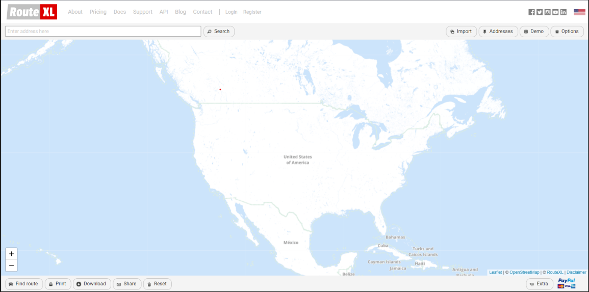
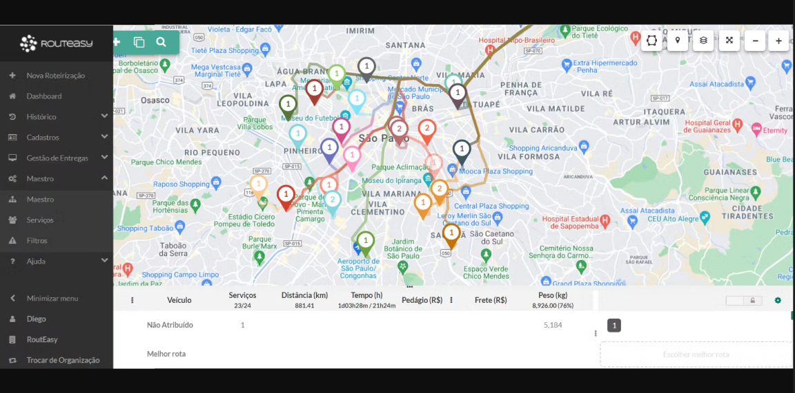
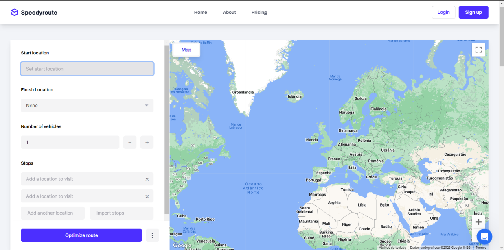
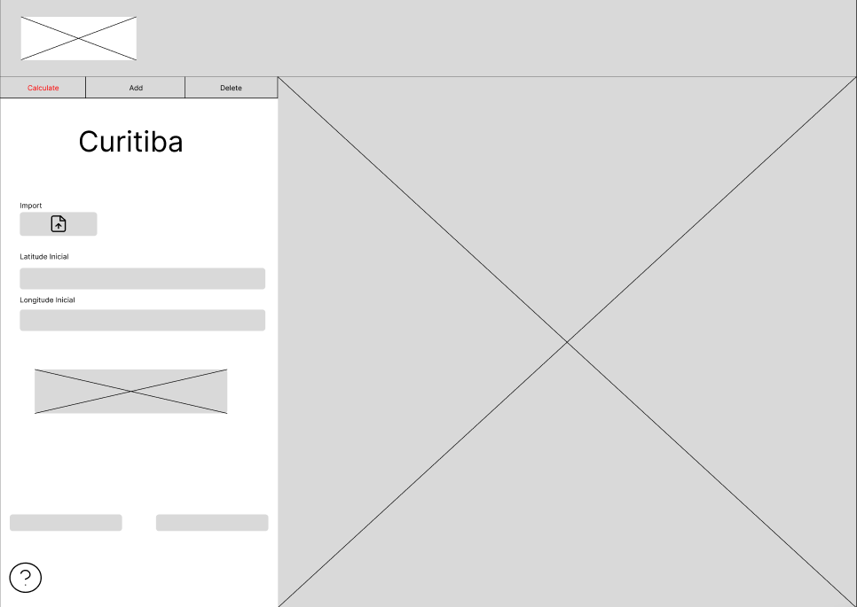
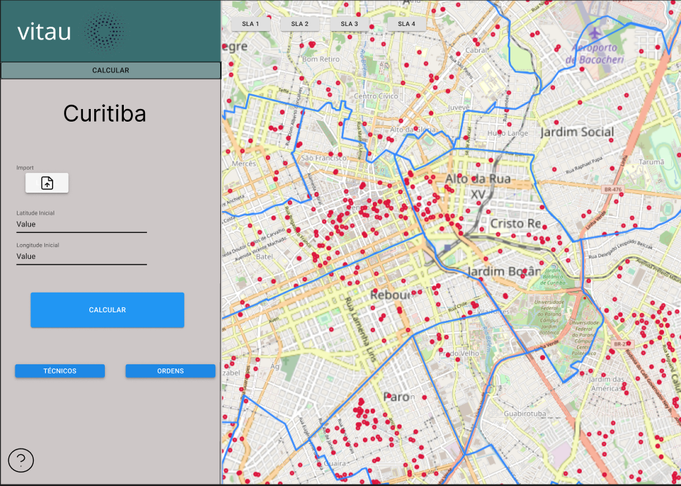
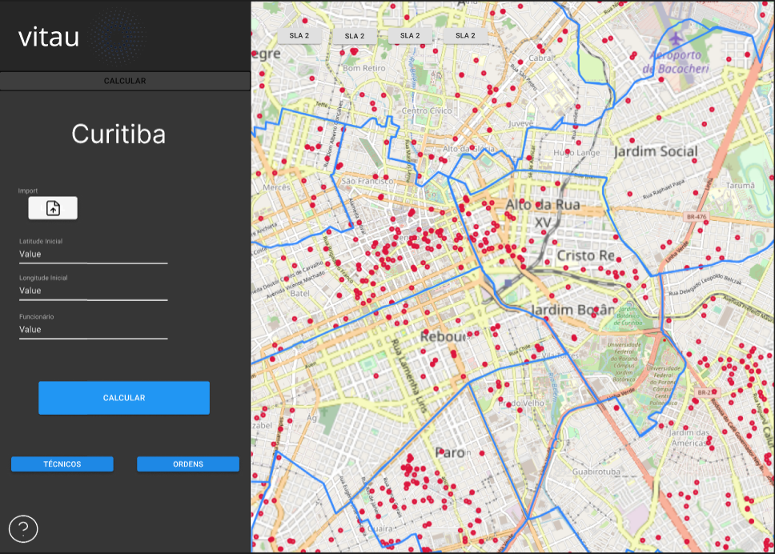
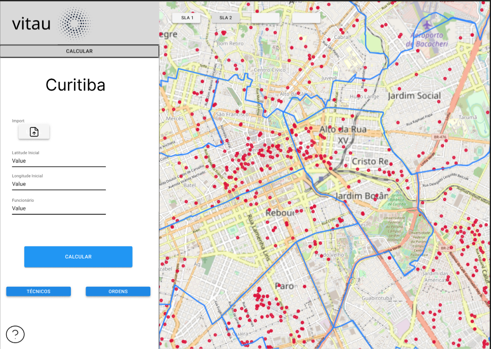
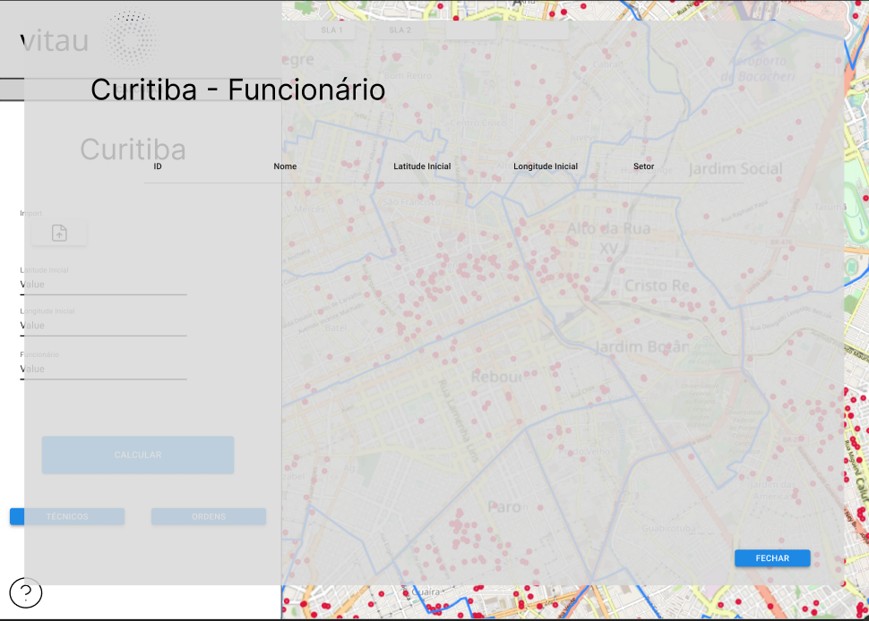
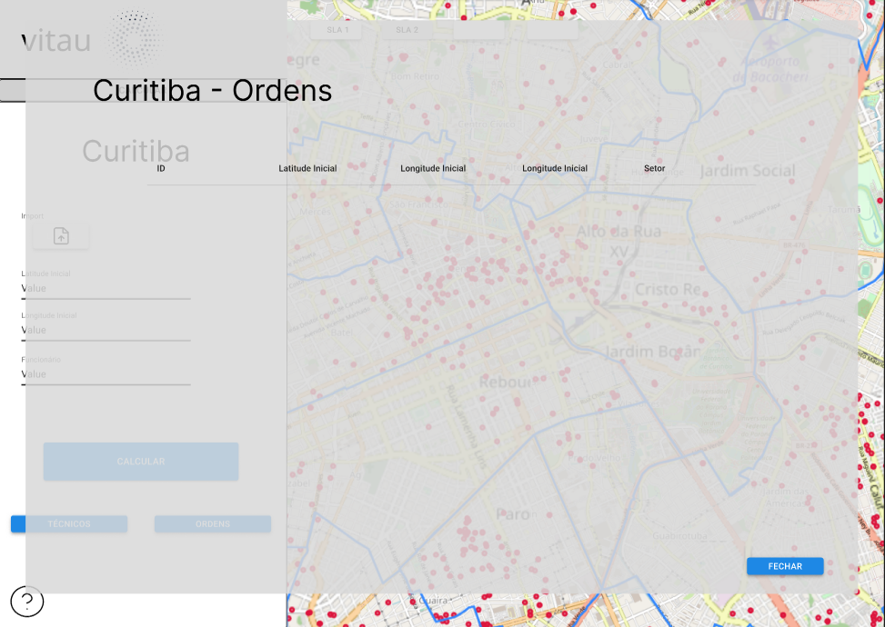
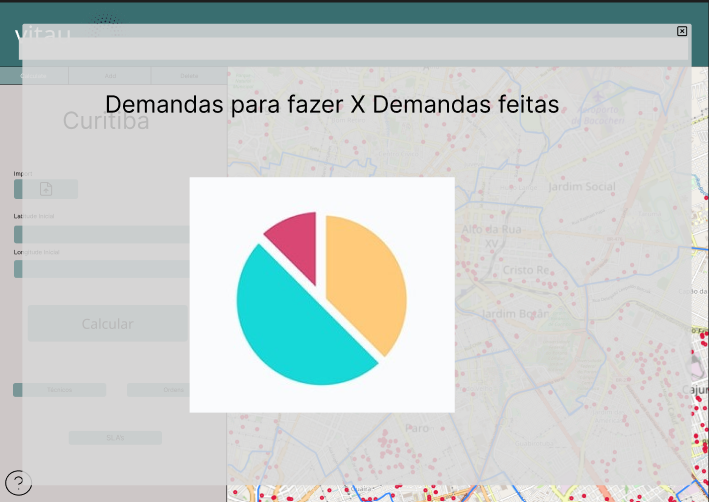

# Figma - vitau

Este documento tem como propósito demonstrar como foi feito todo o processo de construção da aplicação web. Para isso, utilizamos o software Figma para facilitar a estruturação da aplicação.

## Modelos e Exemplos

Para facilitar a modelagem do website, realizamos uma pesquisa em busca de sites que pudessem servir como inspiração ou guiar o direcionamento da estruturação da aplicação.

#### RouteXL

Página Principal do site <a href="https://www.routexl.com/">RouteXL</a>

#### RouteEasy

Página Principal do site <a href="https://www.routeasy.com.br/">RouteEasy</a>

#### SpeedyRoute

Página Principal do site <a href="https://www.speedyroute.com/">SpeedyRoute</a>

Com base nesses exemplos, iniciamos a modelagem da nossa aplicação. Dessa forma, foi elaborado, inicialmente, um wireframe para auxiliar na identificação da posição de cada componente.

## Wireframe

O wireframe consiste em uma representação visual simplificada de uma interface de usuário, desenhada com o propósito de esboçar a estrutura e o layout de um website, aplicativo ou outra plataforma digital. Composto por linhas básicas e formas, o wireframe destaca a disposição de elementos-chave, como áreas de conteúdo, navegação e botões, proporcionando uma visão clara da arquitetura da informação.

Wireframe da Página Principal

Após a criação do Wireframe da página Principal, comecamos a estilizar a página. Nesse momento, foi pensando em 3 maneiras diferentes de estilizar a página principal, sendo elas:

Alternativa 1 da Página Principal

Alternativa 2 da Página Principal

Alternativa 3 da Página Principal

A página principal será o centro da nossa aplicação web. Nela, será possível utilizar nosso algoritmo para encontrar uma solução viável para o cliente, permitindo a visualização da resposta pelo mapa ou por meio de um Excel que será exportado. Além disso, teremos dois botões, um para tecnicos e outro para ordens, que abrirá um modal, onde será possível visualizar todos os tecnicos que estão atendendo e as ordens, respectivamente.

Modal da tabela de Funcionários

Modal da tabela de Ordens

Caso queira acompanhar o desenvolvimento pelo o proprio Figma: <a href="https://www.figma.com/file/DsYxBRfBgFjLsgy5t90aMw/Figma---vitau?type=design&node-id=0%3A1&mode=design&t=C7BLAOVjHOiB6rql-1">Clique aqui</a>

Terá um botão de 'SLA's', onde será possível visualizar gráficos sobre os indicadores de qualidade de serviços (SLA's).

Gráfico de SLA's

Caso queira acompanhar o desenvolvimento pelo o proprio Figma: <a href="https://www.figma.com/file/DsYxBRfBgFjLsgy5t90aMw/Figma---vitau?type=design&node-id=0%3A1&mode=design&t=C7BLAOVjHOiB6rql-1">Clique aqui</a>