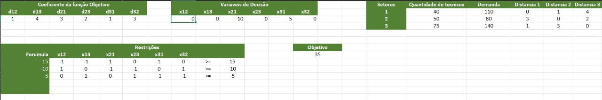
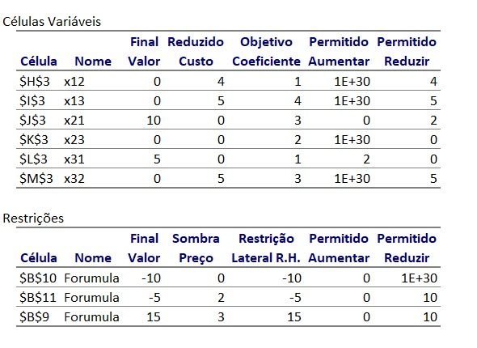

# Entendimento do contexto do problema: 

Este artefato busca entender o contexto do problema, desde o entendimento do problema até a criação de uma modelagem matemática para a estruturação de um algoritmo.

## Modelagem e Representação.

### Qual o contexto do problema a ser resolvido?

Com o crescente interesse pela tecnologia 5G no Brasil, as principais operadoras redirecionaram seus investimentos para essa nova área, reduzindo aportes em outros setores, como a expansão da infraestrutura de fibra óptica. Esse movimento abriu oportunidades para outras empresas ingressarem de maneira significativa no mercado de fibra óptica, oferecendo serviços de rede neutra às operadoras.

Nesse contexto, a V.tal emerge como uma protagonista promissora. Com uma equipe de 6000 técnicos abrangendo mais de 2300 cidades em todo o país, o problema enfrentado pela V.tal reside na otimização dessa força de campo. A alocação dos técnicos, que atendem às instalações de conectividade, é vital para cumprir os níveis de serviço (SLAs). No entanto, mais do que apenas a alocação estática, a otimização da distribuição considerando a movimentação estratégica dos técnicos entre diferentes setores é crucial. Essa flexibilidade na alocação visa atender de maneira eficiente às variações nas demandas de instalações e reparos em diferentes regiões, tornando-se um desafio crítico para a empresa.

Portanto, a V.tal busca otimizar não apenas a alocação inicial, mas também a capacidade de movimentar seus técnicos de forma inteligente entre setores, garantindo uma resposta ágil às demandas flutuantes e assegurando uma gestão eficaz da força de campo. Isso não apenas controla os custos operacionais, mas também contribui significativamente para a satisfação dos clientes, destacando-se como um diferencial competitivo no dinâmico mercado de fibra óptica.

### Quais os dados disponíveis?

Os dados utilizados foram fornecidos pela V.tal, durante reuniões e apresentações, bem como por meio do documento denominado TAPI, disponibilizado pela empresa.

- Quantidade de técnicos por Cidade.
  
- Quantidade de Instalações realizadas diariamente em cada Cidade.
  
- Quantidade de Reparos efetuados diariamente em cada Cidade.
Duração média de cada Instalação/Reparo (em média, 2 horas).

- Tabela com todas as demandas (instalações e reparos) do mês de setembro de 2023, com endereço, tipo de ocorrência, setor, data de início, data de execução do serviço, número, bairro, CEP, latitude e longitude da localidade do serviço.
  
- Tabela com informações relacionadas aos técnicos, como Município de atuação, matrícula do técnico e setor de trabalho.
  
- Tabela com informações dos setores, incluindo Município, quantidade de setores e dados de todos os polígonos (latitude e longitude) que compõem os setores.

### Qual o objetivo do problema?

O objetivo central deste problema é otimizar a gestão da força de campo da V.tal, composta por mais de 6000 técnicos distribuídos em todo o país. Isso envolve a alocação eficiente desses técnicos, considerando suas localizações e as demandas variáveis de instalações e reparos em diferentes áreas e regiões, enquanto assegura o cumprimento dos níveis de serviço (SLAs) relacionados às instalações e reparos de maneira eficaz. Essa otimização visa a maximização da produtividade dos técnicos, entendida como atender a maior quantidade de serviços dentro do dia de trabalho. Isso favorece o aumento da eficiência operacional da empresa, a satisfação do cliente e a consolidação da posição da V.tal no mercado de fibra óptica.

### Identifique pelo menos dois recursos que representam limitações neste problema?

Para abordar de forma eficaz o desafio de otimização da V.tal, é de suma importância compreender as várias limitações e recursos disponíveis.

Dentre elas estão:

**Número máximo de Instalações/Reparos por técnico por dia**: Esta limitação afeta diretamente a produtividade dos técnicos. Se a quantidade de instalações/reparos por técnico for muito baixa, isso pode levar a uma subutilização dos recursos. Por outro lado, se for muito alta, pode resultar em sobrecarga, atrasos e possíveis erros nas operações.

**Jornada de Trabalho Limitada a 8hrs/Dia**: A restrição da jornada de trabalho a 8 horas diárias impõe uma limitação de tempo significativa. Se uma alocação eficiente não for feita dentro desse período, pode haver dificuldades em atender a todas as demandas e garantir a satisfação do cliente.

**Distância Máxima de 50 km entre ocorrências**: A limitação da distância máxima que um técnico pode percorrer entre uma ocorrência e outra é crucial para otimizar o tempo de deslocamento e maximizar a eficiência. Exceder esse limite pode resultar em atrasos e, consequentemente, comprometer a qualidade do serviço.

**Quantidade de técnicos na cidade**: O número de técnicos disponíveis em uma cidade é um recurso crítico. Se houver uma falta de técnicos em uma área com alta demanda, pode haver dificuldades em atender a todas as ocorrências a tempo. Por outro lado, ter um excesso de técnicos em uma cidade de baixa demanda pode levar à subutilização de recursos e aumento de custos.

## Modelagem Matemática
### Introdução:
A V.tal, uma empresa com uma extensa rede de fibra óptica que abrange todo o território brasileiro, depende de uma considerável força de trabalho, composta tanto por funcionários internos quanto por terceirizados, para realizar instalações e reparos em sua infraestrutura, visando atender às necessidades de seus clientes. Atualmente, a empresa conta com aproximadamente 80 colaboradores encarregados de alocar recursos e planejar as rotas para que seus técnicos possam executar as tarefas de instalação e reparo em todo o país.

Entretanto, o processo de criação de rotas não é otimizado, replicável ou automatizado. Em vez disso, depende de uma abordagem visual que envolve a divisão do território em áreas geográficas, chamadas de "setores". Esses setores são definidos com base nas cidades e agrupam ordens de serviço e funcionários, simplificando o problema e facilitando a tomada de decisões por parte dos gestores.

O desafio apresentado à V.tal é a necessidade de realocar funcionários entre esses setores, garantindo que as ordens de serviço sejam atendidas de forma eficiente e minimizando o tempo de deslocamento entre os funcionários transferidos. Porém, pensamos em algo a mais: maximizar a quantidade de atendimentos que os técnicos fazem em um dia.

---

### Contextualização:
O projeto possui os seguintes dados para serem trabalhados:
- Coordenadas das ordens de reparo ou instalação,
- Coordenadas que delimitam os setores,
- Quantidade de funcionários por setor,
- Jornada de trabalho <= 8,
- Tempo médio de um ponto i ao j a partir da API do Google,
- Número de ordens por setor,
- Técnicos externos ou não.
  

Um conceito importante é a ideia de slot de tempo em que os funcionários podem ser alocados. Um slot possui 4 horas, 2 horas para deslocamento e 2 horas para atendimento. Sabendo que a jornada de trabalho possui 8 horas, podemos ter no máximo dois slots, ou seja, 4 horas de deslocamento e 4 horas de atendimento.

Logo, o deslocamento total ($D_t$) tem que ser menor ou igual a 4 horas.

Um atendimento possui por padrão 2 horas, logo um funcionário pode fazer, no máximo, 3 atendimentos, pois caso sejam 4, teremos 8 horas de trabalho, o mesmo valor da jornada de trabalho do funcionário.

---

### Função Objetivo:
Maximizar o tempo que os funcionários passam em sua jornada de trabalho atendendo.

$$max\hspace{0.2cm} z = \sum_{k=1}^{n}\sum_{i=1}^{m}\sum_{j=1}^{m} x_{kij}(A - D_{kij})$$

$k =$ Funcionário.

$
x_{kij} = \begin{cases}
1, & \text{se o caminho do ponto i ao j for escolhido} \\
0, & \text{caso contrário}
\end{cases}
$

$A =$ constante de tempo de atendimento médio

$D_{kij} =$ tempo de deslocamento do funcionário k do atendimento i ao j

---

### Restrições:

Tempo de deslocamento total em uma jornada de trabalho:
$$D_{\text{total}} <=4 \hspace{0.2cm} \text{ou} \hspace{0.2cm} \sum(x_{kij}(Dkij)) <=4$$

Tempo máximo que um funcionário pode atender em sua jornada de trabalho:
$$A_{\text{total}} <=6 \hspace{0.2cm} \text{ou} \hspace{0.2cm} \sum(x_{kij}(A)) <=6$$

Limite da soma do tempo de deslocamento e o tempo de atendimento em uma jornada de trabalho:
$$\sum(x_{kij}(A + D_{kij})) <=8$$

Apenas um único funcionário pode atender uma ordem:
$$\sum{x_{kij}} = 1 \forall j \neq \text{depot}$$

Apenas um funcionário pode sair de uma ordem:
$$\sum{x_{kij}} = 1 \forall i \neq \text{depot}$$

Verifica se é o mesmo veículo:
$$\sum_{k}\sum_{i} x_{kih} - \sum_{k}\sum_{j} x_{khj} = 0 \forall h,k$$

Eliminacão de subtour:
$$\sum_{kij}{x_{kij}} = |S| - 1 \forall S \subseteq P(N), 0\notin S $$

---

### Função objetivo hipotética para o artefato:
Para identificar os gargalos do problema e analisar a tabela de sensibilidade, tivemos que transformar o nosso problema que era inteiro para linear, então, a nossa função objetivo ficou como: 

Minimizar o tempo de deslocamento do setor i ao setor j.
 $$min\hspace{0.2cm} z = \sum_{i=1}^{k}\sum_{j=1}^{k} X_{ij}\times D_{ij}; \ \ \forall i \neq j$$

onde:

- $k =$ Quantidade de setores.

- $X_{ij} =$ Quantidade de tecnicos que saem do setor  i para j.

- $D_{ij} =$ Tempo de deslocamento do setor i ao j

- $T_{i} =$ Quantidade de funcionários no setor i.

- $O_{i} =$ Quantidade de ordens no setor i.

**Restrições:**

1. $X >= 0$: As quantidades de técnicos alocados devem ser não negativas.

2. $D_{ij} >= 0 $: O tempo de deslocamento entre setores deve ser não negativo.

3. $D_{ij} <= 4 $: O tempo de deslocamento deve ser menor ou igual a 4 horas.

4. $\sum x_{ij} <= T_{i} $: A quantidade de técnicos alocados de um setor i para outros setores não pode exceder a quantidade total de técnicos no setor i.

5. $\sum_{j}^{k} T_{i} + X_{ji}-X_{ij} >= \frac{O_{i}}{2}$: A diferença entre a quantidade total de técnicos no setor i e a quantidade que sai para outros setores deve ser maior ou igual à metade da quantidade de ordens no setor i. Isso garante que o setor i atenda à sua demanda, considerando também a possível transferência de técnicos de outros setores.

Essas restrições definem um modelo linear que busca minimizar o tempo de deslocamento, garantindo eficiência na alocação de técnicos e atendimento das demandas de cada setor.

**Tabela Excel:**

**Tabela de sensibilidade:**

Uma tabela de sensibilidade, também conhecida como análise de sensibilidade, é uma ferramenta utilizada em modelos de programação linear para avaliar o impacto de variações nos parâmetros do modelo nas soluções ótimas. Ela fornece informações valiosas sobre como as mudanças nos coeficientes da função objetivo ou nas constantes das restrições afetam a solução ótima do problema.

### Identificação dos gargalos do problema:
Existem duas restrições nas quais gargalos podem ser identificados com facilidade. A primeira refere-se ao tempo de deslocamento de um setor 
i para um setor j, onde, caso esse tempo seja igual a 4 horas, ou seja, atenda o limite da restrição, a transferência de funcionários ainda pode ser realizada. A segunda restrição envolve a contabilização da quantidade de funcionários no setor i para a possível transferência de funcionários de outros setores para i, menos a saída de funcionários do setor i para outros setores. Essa quantidade deve ser maior ou igual à demanda que precisa ser atendida.

No caso identificado acima, onde houve uma sobra de funcionários em todos os setores, exceto um, e nesse setor a quantidade de ordens que deveriam ser atendidas é exatamente igual à quantidade de funcionários que sobraram de todos os outros setores, e o tempo de deslocamento de todos esses outros setores atendia à restrição de ser menor ou igual a 4 horas, temos uma situação de gargalo.

Esse cenário destaca a importância de considerar não apenas a quantidade de funcionários disponíveis, mas também as restrições de tempo de deslocamento, para garantir uma alocação eficiente que atenda à demanda de cada setor.

### Como a alteração na quantidade de ordens de serviço por setor e a variação nos custos de deslocamento dos técnicos entre diferentes setores influenciam a eficiência e o custo do modelo de alocação de técnicos?
Em relação ao custo do deslocamento dos técnicos entre diferentes setores, a variação não influenciará, desde que respeite a restrição de ser menor ou igual a 4 horas. Caso esta restrição seja atendida, independentemente do setor i que esteja com falta de funcionários para atender à sua demanda, um setor j qualquer que também esteja com falta de funcionários permitirá a transferência, contanto que o tempo de deslocamento de j para i seja menor ou igual a 4 horas.

Essa abordagem permite uma flexibilidade na alocação de técnicos, priorizando a eficiência operacional ao considerar não apenas a demanda imediata de um setor específico, mas também a capacidade de atendimento de outros setores que estejam dentro do limite de tempo de deslocamento estabelecido. Isso contribui para otimizar a distribuição de recursos e garantir uma resposta eficaz às demandas em diferentes partes da organização.

### Como um aumento ou diminuição de 10% nos custos de deslocamento dos técnicos impacta no custo total do processo de alocação de técnicos?
Com os testes realizados, podemos concluir que uma alteração de 10% no custo de deslocamento dos técnicos não impacta no processo de alocação, contanto que essa alteração não ultrapasse 4 horas. Isso ocorre porque, caso a restrição de tempo seja respeitada, a transferência de funcionários de um setor i para um setor j ocorrerá, mesmo que ambos apresentem a capacidade de alocação.

Entretanto, é importante ressaltar que, se o custo de deslocamento for reduzido a ponto de tornar o tempo de transferência inferior a 4 horas para setores anteriormente inatingíveis, isso pode alterar significativamente o resultado final. A diminuição do tempo de deslocamento pode tornar setores anteriormente inelegíveis para transferência agora elegíveis, o que impacta diretamente na otimização do processo de alocação de técnicos.

Em resumo, a restrição de 4 horas desempenha um papel crucial na decisão de transferência entre setores, e qualquer alteração nos custos de deslocamento deve ser avaliada considerando seu impacto na elegibilidade para transferências, influenciando assim o resultado final do processo de alocação.

