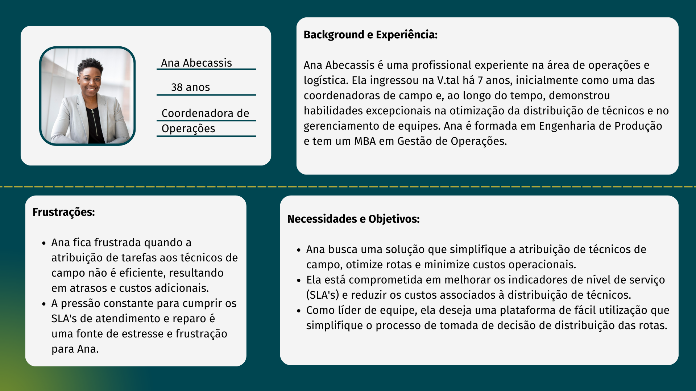
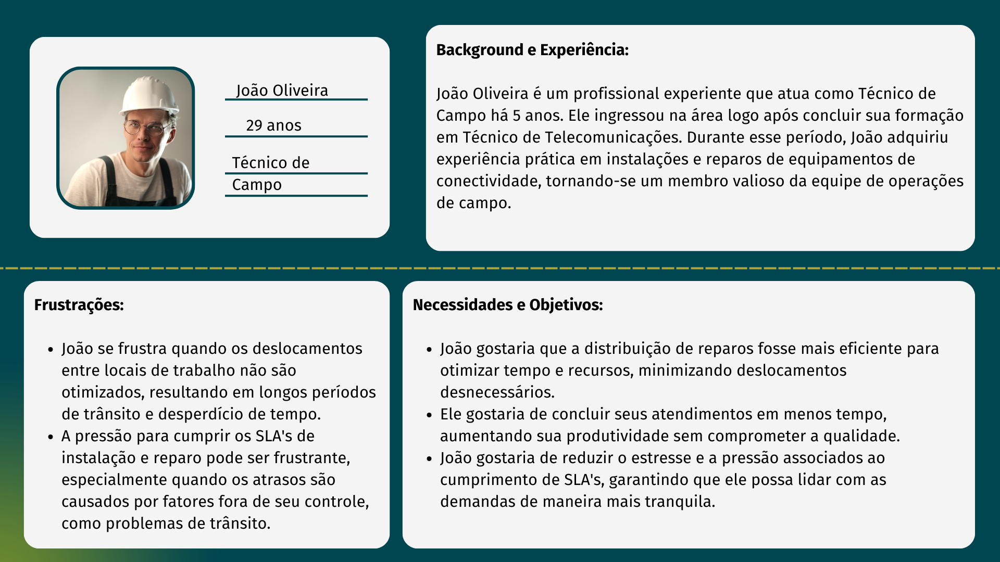
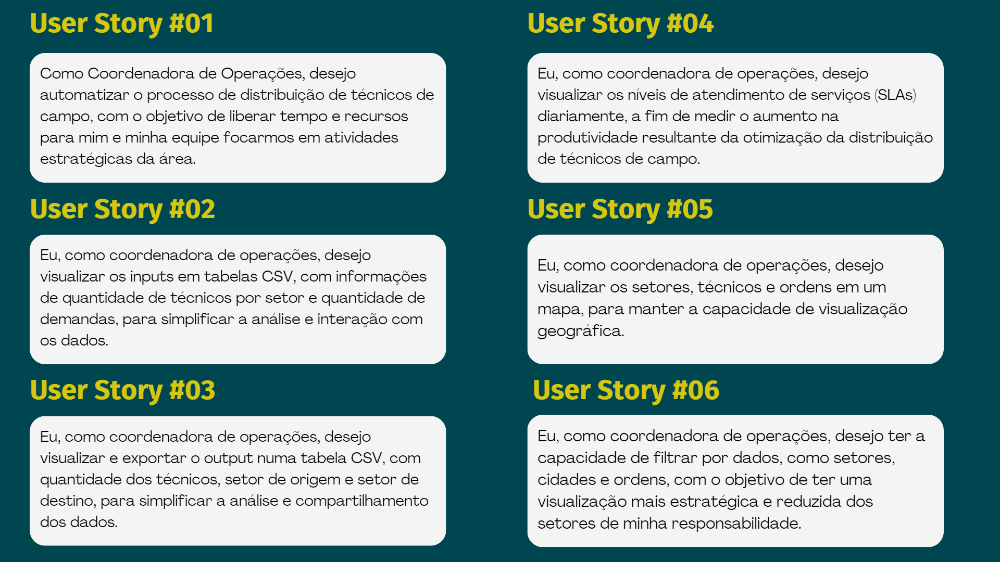

# Entendimento da experiência do usuário

*Neste artefato, apresentamos um estudo abrangente da experiência do usuário. Este estudo é composto por uma análise detalhada de duas personas distintas, que representam os principais usuários da nossa solução. Além disso, abordamos cinco user stories que capturam os cenários de uso essenciais. Para proporcionar uma visão completa, também detalhamos as jornadas do usuário, descrevendo as etapas e interações envolvidas ao utilizar nossa solução. Este documento serve como um recurso valioso para a compreensão profunda das necessidades e expectativas dos usuários, bem como um guia essencial para o desenvolvimento de uma solução centrada no usuário.*

## Personas

*Nas personas, criamos perfis abrangentes para dois usuários-chave do projeto: a Coordenadora de Operações, representada por Ana Abecassis, e o Técnico de Campo, personificado por João Oliveira. Essas personas foram desenvolvidas com base em suas necessidades e objetivos, experiências e frustrações.*

Figura 01: Persona 'Coordenadora de Operações'

 

Figura 02: Persona 'Técnico de Campo'

*Ao compreender as necessidades e frustrações de Ana e João, obtivemos insights valiosos que direcionam a concepção da solução de otimização da distribuição de técnicos. Isso nos permite garantir que a solução seja verdadeiramente centrada nas expectativas e prioridades das partes envolvidas, ao mesmo tempo que alivia as complexidades operacionais enfrentadas por esses profissionais. As personas de Ana e João servirão como guias essenciais ao longo do projeto, influenciando o design, o desenvolvimento e a tomada de decisões para garantir que a solução seja eficaz e atenda às necessidades reais dos envolvidos no processo de otimização.*

## Jornada do Usúario

A jornada do Usúario consiste em um framework que busca exemplificar a experiencia completa de um usuário ao interagir com um produto, serviço ou plataforma, desde o primeiro contato até a conclusão de seu objetivo.

O framework pode ser dividido em 5 partes: **Cenário**, **Expectativas**, **Oportunidades**, **Responsabilidades** e **Jornada**:

**Cenário**: O cenário oferece uma visão abrangente do ambiente em que o usuário está inserido, abrangendo informações demográficas, requisitos, e preferências. Essa análise é essencial para estabelecer uma compreensão do perfil do usuário, bem como de seus objetivos e motivações.

**Expectativas**: Nesta etapa, examinamos as expectativas do usuário. Isso envolve o que o usuário espera alcançar ao interagir com o produto ou serviço, bem como as metas que ele deseja cumprir.

**Oportunidades**: Na Oportunidades, identificamos as oportunidades para melhorar a experiência do usuário. Isso inclui pontos de contato onde podemos aprimorar a interação e fornecer maior valor ao usuário.

**Responsabilidades**: Está relacionado às responsabilidades do usuário ao utilizar o produto ou serviço. Isso ajuda a estabelecer papéis claros e expectativas do usuário.

**Jornada**: A jornada está relacionada à narrativa, responsavel por detalhar as etapas que o usuário percorre ao usar o produto ou serviço, desde o início até a conclusão de seu objetivo. Isso inclui todas as interações, desafios e emoções ao longo do caminho. 

Figura 3: Jornada do Usuário com a persona Ana Abecassis.

## User Stories

*Nesta seção, apresentamos um conjunto de user stories que capturam as necessidades, objetivos e expectativas da Coordenadora de Operações, a principal usuária-chave do projeto de otimização da distribuição de técnicos de campo da V.tal. Cada user story é uma narrativa concisa e centrada no usuário, descrevendo as funcionalidades, características e benefícios essenciais da solução. Essas histórias desempenham um papel crucial na orientação do desenvolvimento, assegurando que a solução seja ajustada às demandas da Coordenadora de Operações e cumpra seus objetivos. Elas servem como um elo vital entre a Coordenadora de Operações e a equipe de desenvolvimento, garantindo uma visão compartilhada e focada nas prioridades do projeto.*

Figura 04: User Stories

