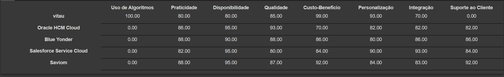
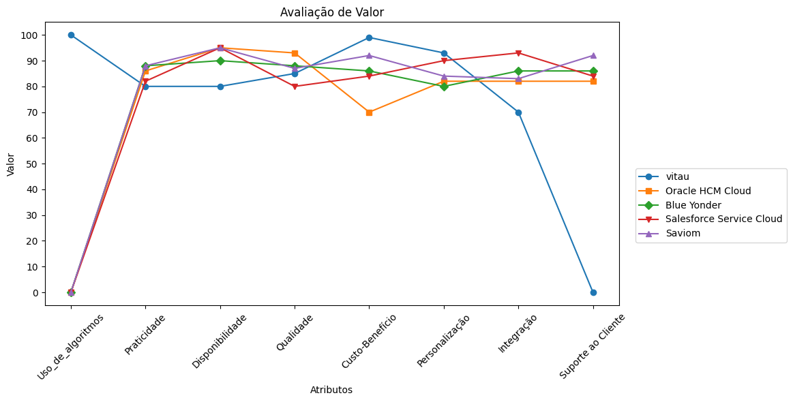
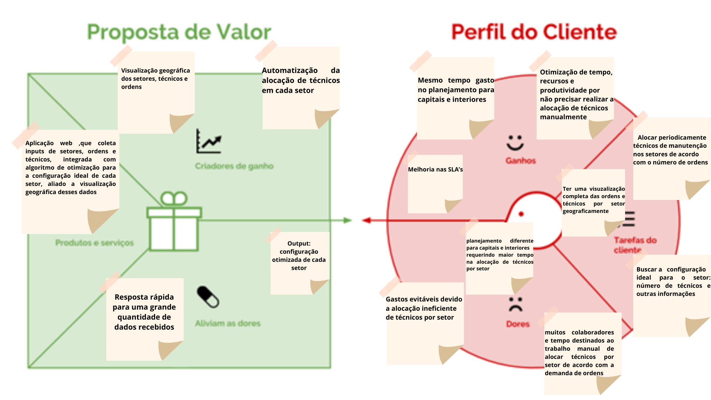
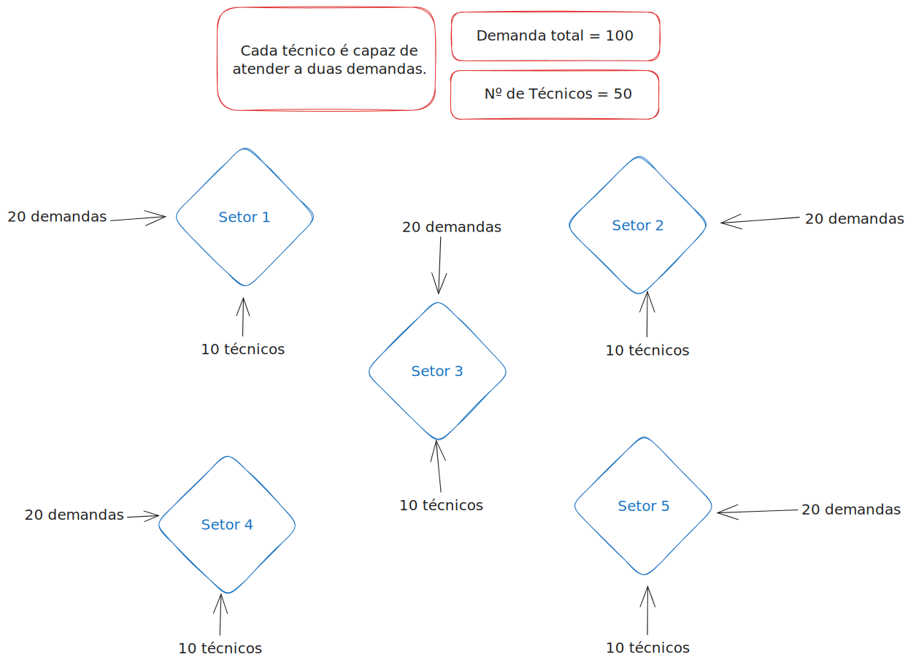
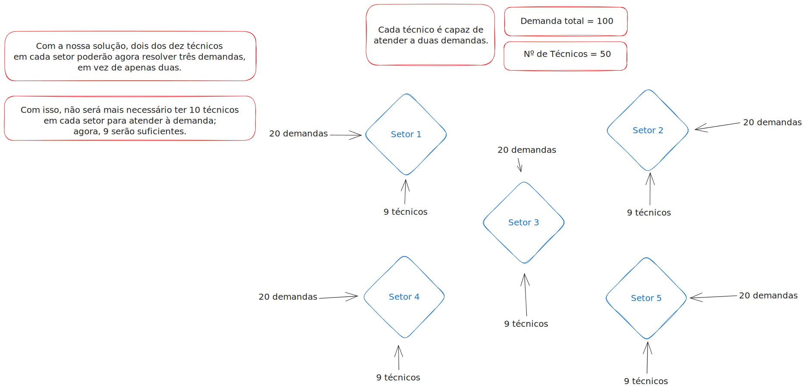

# Entendimento de negócio

Neste artefato, apresentamos uma análise abrangente do negócio, utilizando diversos frameworks, como Oceano Azul, Matriz de Risco, Canvas de Proposta de Valor e Análise Financeira. O objetivo é obter um entendimento mais profundo da empresa com a qual planejamos colaborar. Este documento serve como um recurso para compreender a empresa, suas operações e seu potencial no mercado, fornecendo uma base sólida para futuras decisões e estratégias de negócio.

## Matriz de Oceano Azul

O framework "Oceano Azul" foi desenvolvido por W. Chan Kim e pela Renée Mauborgne em 2005 com a missão de oferecer uma abordagem estratégica inovadora às empresas, incentivando a exploração de novos mercados, em detrimento da concorrência acirrada em mercados saturados. Os criadores, Kim e Mauborgne, propõem que as organizações busquem oportunidades de crescimento em "oceanos azuis", territórios inexplorados e livres de competição. Uma das ferramentas essenciais dentro deste framework é a matriz de Avaliação de Valor, que auxilia as empresas na identificação e exploração de novos mercados, comparando atributos como qualidade, praticidade, custo-benefício e entre outros.

Além disso, para diferenciar as empresas que utilizam-se do "Oceano Azul", é empregada uma estratégia que se resume nas ações: Reduzir, Eliminar, Aumentar e Criar. Essas ações visam diferenciar as empresas e produtos, permitindo que se destaquem em ambientes de mercado não convencionais e inexplorados.

### Reduzir:
Nessa ação, a ideia é reduzir ou simplificar características presentes em produtos ou serviços tradicionais, tendo em vista que a mudança não impacta negativamente o usuário.

### Aumentar:
Nessa ação, o foco está em ampliar os atributos que são valorizados pelos clientes, visando proporcionar maior valor e eficiência do que os concorrentes oferecem aos usuários finais.

### Criar:
Essa ação envolve a criação de um atributo. Ou seja, seria o diferencial da solução em relação aos demais concorrentes.

### Eliminar:
Nessa ação, a estratégia envolve a remoção de atributos que a concorrência pode considerar essenciais, mas que, na realidade, não afetam significativamente o valor percebido pelo cliente.

## Matriz de Avaliação de Valor

Para realizar a avaliação de valor foi pesquisado empresas concorrentes que tivessem alguma semelhança com a solução criada.

Dentre elas estão:

**Oracle HCM Cloud**: A Oracle HCM Cloud é uma divisão da Oracle Corporation que oferece soluções abrangentes de gerenciamento de recursos humanos baseadas em nuvem, capacitando organizações de todos os tamanhos e setores a otimizar suas operações de RH, desde recrutamento e desenvolvimento de talentos até designação de colaboradores e análise de dados.

**Saviom**: A Saviom é uma empresa, originária da Austrália, especializada em soluções de gerenciamento de força de trabalho e planejamento de capacidade, ajudando organizações a aprimorar a alocação de recursos humanos de forma eficiente e a reduzir custos. Possui como cliente empresas como: Siemens, DHL e Fujitsu.

**Salesforce Service Cloud**: A Salesforce Service Cloud é uma solução pertencente da empresa Salesforce com foco na automação e na otimização de processos, a Service Cloud permite que as equipes de suporte ofereçam um atendimento rápido e personalizado aos clientes, tornando as interações mais eficientes e satisfatórias. Ela capacita as empresas a criar fluxos de trabalho sob medida, automatizar tarefas repetitivas e acompanhar o progresso das solicitações dos clientes em tempo real. Além disso, a Service Cloud integra-se com outras ferramentas da Salesforce, permitindo que as empresas unifiquem seus dados e processos para fornecer uma visão integrada para o cliente. As empresas que utilizam-se desse serviço são: Coca-Cola, Unilever e American Express.

**BlueYonder**: A Blue Yonder é uma empresa fundada em 1985 nos EUA(Estados Unidos da América) especializada em soluções avançadas de cadeia de suprimentos e planejamento de demanda. Ela oferece ferramentas e tecnologias para ajudar empresas a otimizar suas operações e melhorar a eficiência na gestão da cadeia de suprimentos. Dentre as empresas parceiras estão: Pepsi, Walmart, e DHL. 

Com base nessas empresas, criou-se uma tabela com os valores de cada atributo dependendo da empresa. Em seguida, construiu-se um gráfico para que seja possível visualizar as diferenças entre os concorrentes em determinados atributos/características.

Tabela 1: Valores dos Atributos de cada Empresa.

Figura 1: Avaliação de Valor baseado na Tabela 1.

### Atributos

1 - **Uso de Algoritmos**: A incorporação de algoritmos possibilita a customização e otimização do processo de atribuição de colaboradores em setores específicos, resultando em maior eficiência e, como resultado, serviços mais rápidos e ágeis para atender às necessidades dos clientes. Ele deve descrever de que forma a divisão dos colaboradores entre os setores será realizada, levando em conta todas as limitações/restrições.

2 - **Praticidade**: A praticidade aborda a conveniência e a facilidade de uso da plataforma, abrangendo todos os aspectos voltados à experiência do usuário. Em um site com alta praticidade, os menus são intuitivos, a navegação é fluida e eficiente, as informações estão bem organizadas e de fácil acesso. A disposição de botões e links é lógica, minimizando cliques desnecessários. Além disso, recursos como respostas rápidas a perguntas frequentes(FAQ) e um design responsivo que se adapta a diferentes dispositivos garantem uma experiência de usuário agradável. Isso, por sua vez, melhora a satisfação do cliente e a eficácia da aplicação web.

3 - **Disponibilidade**: Garantir a disponibilidade constante de um produto ou serviço significa que os clientes podem contar com ele sempre que precisarem. Ou seja, esse atributo descreve a capacidade de manter o site operacional de forma contínua, permitindo que o usuário acesse a aplicação levando em consideração todas as suas necessidades, sem interrupções indesejadas.

4 - **Qualidade**: A qualidade em uma aplicação web é um atributo crítico para a satisfação do cliente. Ela abrange diversos aspectos, incluindo a confiabilidade da aplicação, a ausência de erros ou falhas, a eficiência de desempenho, a segurança dos dados e a usabilidade. Os clientes esperam que uma aplicação web funcione de maneira consistente, rápida e segura. 

5 - **Custo-Benefício**: O equilíbrio entre o custo e o benefício é essencial. Os clientes valorizam produtos ou serviços que oferecem um excelente desempenho ou funcionalidade em relação ao preço pago. Esse atributo leva em consideração a relação entre o valor entregue pela plataforma e o custo para adquiri-la.

6 - **Personalização**: A personalização permite atender às necessidades individuais dos clientes, adaptando produtos ou serviços com base em suas preferências e comportamentos, criando uma experiência única. Essa característica deve descrever a capacidade da empresa em permitir a personalização do produto ou serviço, dependendo dos critérios do cliente, sem afetar a experiência do usuário e a qualidade do produto/serviço.

7 - **Integração**: Esse atributo se refere à capacidade do software de se integrar de forma eficaz com outros sistemas e aplicativos, facilitando a troca de dados e a colaboração entre diferentes partes do ambiente de tecnologia da informação. 

8 - **Suporte ao Cliente**: Um bom suporte ao cliente é vital para resolver problemas, esclarecer dúvidas e garantir que os clientes tenham uma experiência positiva. Ou seja, esse fator avalia a disponibilidade e a maneira como a empresa sana as dúvidas e problemas dos clientes.

## Modelo das quatro ações

**Reduzir**: A redução na disponibilidade pode ser atribuída à escolha de ferramentas gratuitas para o deploy da solução, uma vez que essas ferramentas frequentemente apresentam instabilidade, resultando em potenciais períodos de inatividade. Além disso, o atributo da integração também sofreu redução, principalmente devido a restrições de tempo, uma vez que o prazo de apenas 10 semanas para desenvolver a solução tornaria impraticável a integração completa com outros softwares já existentes..

**Aumentar**: O aumento significativo no atributo custo-benefício reflete a decisão de utilizar uma maior proporção de ferramentas gratuitas na implementação da solução, o que permite manter os custos sob controle ao mesmo tempo em que entrega um valor substancial ao cliente. Além disso, a praticidade e a personalização serão aprimoradas, uma vez que a aplicação web está sendo desenvolvida sob demanda, com uma comunicação constante com os clientes para direcionar o desenvolvimento desde o início até o término do projeto. Esse envolvimento direto garante que a aplicação atenda de maneira precisa às necessidades dos clientes. Por fim, a qualidade será aprimorada, já que a equipe está comprometida em implementar rigorosos processos de teste e garantir que a aplicação seja robusta, confiável e livre de erros, proporcionando uma experiência excepcional aos usuários finais.

**Criar**: A introdução do atributo Uso de Algoritmo é um passo inovador na criação da solução, uma vez que a aplicação incorporará um algoritmo baseado em programação linear para otimizar a designação de colaboradores. Esse algoritmo será fundamental para a alocação eficiente de recursos, considerando variáveis como disponibilidade, habilidades e demanda, resultando em atribuições mais precisas e equilibradas. A inclusão desse atributo promete elevar a eficiência operacional e a satisfação do cliente, ao mesmo tempo em que maximiza a utilização dos recursos disponíveis.

**Eliminar**: A decisão de eliminar o atributo Suporte ao Cliente do projeto é baseada no cronograma restrito de apenas 10 semanas para a produção. Após esse período, a equipe de desenvolvimento reconheceu que não seria viável oferecer um suporte ao cliente eficaz e abrangente. Embora o suporte ao cliente seja inegavelmente valioso, as restrições temporais levaram à priorização de outros aspectos do projeto, como o desenvolvimento e a qualidade da solução, garantindo que ela seja entregue dentro do prazo e atenda às expectativas do cliente durante o uso.

## Matriz de Riscos

Figura 02: Matriz de Riscos

Figura 03: Índices

### Descrições dos Índices detalhado:

| Índice | Detalhamento                                                |
|--------|------------------------------------------------------------|
| A      | A interface não é compreensível para o usuário, atrapalhando o uso eficiente do software ou serviço e tornando a experiência do usuário frustrante e confusa.  |
| B      | Falhas de segurança na aplicação web podem representar um sério problema, dificultando a integração aos sistemas da empresa Vital. Essas falhas podem expor dados sensíveis da empresa a ameaças cibernéticas, comprometendo a confidencialidade, integridade e disponibilidade das informações.   |
| C      | Conseguir exportar informações sobre os detalhamentos dos percursos/áreas de trabalho dos colaboradores, permitindo a geração de um relatório completo do dia para os colaboradores, é crucial para promover a transparência, a accountability e a eficiência no ambiente de trabalho.    |
| D      | Conseguir fazer a otimização da distribuição dos técnicos, desenvolvendo um algoritmo eficiente para mais de 6000 técnicos, e abrangendo 2300 cidades em todo o Brasil.    |
| E      | Atingir a eficiência operacional proporcionada pelo projeto, permitindo abranger novas áreas de negócios e investimentos. Isso se torna possível ao aumentarmos a eficiência com o nosso algoritmo, o que permite à empresa economizar recursos e, consequentemente, redirecionar o capital economizado para outras áreas de negócio e oportunidades de crescimento.    |
| F      |  A viabilidade da API do Google Maps pode ser afetada por alterações nas políticas ou disponibilidade do Google, introduzindo riscos de dependência.   |
| G      | Recebermos dados não estruturados da Vital pode dificultar a criação do algoritmo de otimização, uma vez que a falta de estruturação pode exigir esforços adicionais na limpeza, preparação e transformação dos dados em um formato adequado para análise.    |
| H      |  Benchmark do algoritmo ser bem-sucedido envolve estabelecer métricas de desempenho claras e mensuráveis, bem como realizar testes rigorosos para avaliar seu desempenho em diversas situações. Isso inclui testes de carga, testes de estresse e simulações de cenários reais para verificar a escalabilidade.   |
| I      |  Mudanças nas regulamentações das APIs usadas, com a possibilidade de torná-las pagas em um futuro próximo, representam um risco financeiro e operacional, exigindo revisão de orçamento e estratégias alternativas, e fazendo com que o projeto não funcione conforme o planejado.   |
| J      |  Dificuldades de treinamento para uso da plataforma podem resultar em atrasos na adoção do sistema e baixa eficácia dos usuários.  |
| K      |  A oportunidade de melhorar os SLA's (Service Level Agreements) por meio do sucesso do projeto representa a possibilidade de elevar a qualidade dos serviços, aumentar a satisfação do cliente, fortalecer a reputação no mercado, otimizar eficiência operacional, reduzir custos, impulsionar o crescimento de receita e garantir o cumprimento de regulamentações   |

## Value Proposition Canvas
O value proposition canvas foi feito com base no projeto que será desenvolvido pelo grupo e está de acordo com a solução que iremos implementar

Figura 04: Value Proposition Canvas

## Análise financeira do projeto

### a) Economia de Tempo e Dinheiro

A implementação bem-sucedida do nosso projeto de algoritmo de otimização trará economias significativas de tempo para a V.tal. Há duas maneiras principais de alcançar essa economia:

#### **Redução na contratação de técnicos**

Contratar menos técnicos será uma realidade com a nossa solução, uma vez que, atualmente, a estimativa da necessidade de técnicos que a V.tal contrata não é feita de uma maneira otimizada, resultando em custos desnecessários e alocação ineficiente de recursos.

Para ilustrar isso, dividiremos o exemplo prático em duas partes: como o trabalho é feito atualmente e como será feito após a implementação do planejador.

**Situação Atual (Antes da Implementação)**:
  
Imagine uma cidade onde a V.tal opera com 100 demandas, igualmente distribuídas em 5 setores. Para atender a essa demanda, a empresa possui um total de 50 técnicos, com 10 técnicos alocados em cada setor.

Nesse cenário, a alocação de técnicos é estática, ou seja, cada técnico resolve 2 demandas diárias. Quando a demanda aumenta, a V.tal se depara com duas possibilidades, a primeira é a necessidade de contratar técnicos extras e a segunda seria de alocar técnicos de outras áreas para área necessitada, isso pode resultar em custos adicionais e, durante períodos de menor demanda, técnicos podem ficar ociosos.

Figura 5: Ilustração de como é feito atualmente.

**Após a Implementação do Planejador**:

Com a implementação do nosso projeto de algoritmo de otimização, o processo de alocação de técnicos será aprimorado.

Graças à otimização proporcionada pelo nosso algoritmo, dois dos dez técnicos em cada setor poderão ser realocados para resolver 3 demandas diárias em vez de 2, garantindo que a demanda seja atendida sem a necessidade de contratar técnicos extras, e dependendo do caso, podendo excluir alguns técnicos que não serão mais necessários.

Figura 6: Ilustração de como será feito com o uso da solução.

Levando em consideração o exemplo mencionado, com base nas informações do site Glassdoor, o salário de um Técnico de Telecomunicações II é estimado em R$2.700,00. Isso nos permite afirmar que, ao otimizar a solução, poderíamos economizar o equivalente ao trabalho de 5 técnicos. Portanto, a V.tal poderia alcançar uma economia mensal de aproximadamente R$13.500 por mês.

### Aumento da produtividade dos operadores

Com base na análise da economia de tempo obtida pelos operadores ao utilizar o algoritmo, é possível estimar uma economia de aproximadamente 1 hora por dia. Vamos detalhar como isso impacta com o exemplo a baixo:

Suponhamos que um Analista Pleno receba um salário mensal de R$5.000, o que equivale a cerca de R$21,25 por hora considerando um mês de trabalho típico. Se a empresa tem 80 operadores que podem economizar essa quantidade de tempo com o uso do algoritmo, a economia mensal seria de aproximadamente R$637,50 por operador. A economia total mensal da empresa, nesse caso, seria de R$637,50 x 80 operadores, resultando em uma economia de R$51.000 por mês.

Isso significa que o Return on Investment (ROI), ou Retorno sobre o Investimento, se daria em um período relativamente curto. Com um investimento estimado de R$95.000,00 para implementar o algoritmo, a empresa alcançaria o ROI em menos de dois meses, considerando a economia mensal de R$51.000 mais a economia dos técnicos em cada setor.

### b) Custo do Projeto

O desenvolvimento e a implementação do projeto envolverão despesas em várias áreas. A seguir, detalhamos os valores estimados de gastos:

| Despesa                  | Valor |
|--------------------------|----------------|
| Desenvolvimento da Equipe | R$67.500,00          |
| AWS (opção 1)                      | R$18.341,00          |
| Azure (opção 1)                   | R$25.043,00          |
| **Custo Total com AWS**          | **R$85.841,00**      |
| **Custo Total com Azure**          | **R$92.543,00**      |

Para informações mais detalhadas sobre as configurações da cloud, [AWS](./docs/AWs.pdf), [Azure](./docs/Azure.xlsx)

**Nota**: O custo do desenvolvimento da equipe foi estimado com base em um salário semanal de R$1.250,00 por desenvolvedor, totalizando R$67.500,00.

## Referências

GARTNER. Oracle Fusion Cloud HCM. Disponível em: https://www.gartner.com/reviews/market/cloud-hcm-suites-for-1000-employees/vendor/oracle/product/oracle-fusion-cloud-hcm?marketSeoName=cloud-hcm-suites-for-1000-employees&vendorSeoName=oracle&productSeoName=oracle-fusion-cloud-hcm. Acesso em: 19/10/2023.

CAPTERRA. Salesforce. Disponível em: https://www.capterra.com.br/reviews/136189/salesforce. Acesso em: 19/10/2023.

CAPTERRA. Saviom Resource Management. Disponível em: https://www.capterra.com.br/reviews/81410/saviom-resource-management. Acesso em: 19/10/2023.

GARTNER. Blue Yonder Luminate Planning. Disponível em: https://www.gartner.com/reviews/market/supply-chain-planning-solutions/vendor/blue-yonder/product/luminate-planning. Acesso em: 19/10/2023.

BLUE YONDER. Workforce Management. Disponível em: https://blueyonder.com/br/pt/solutions/workforce-management. Acesso em: 19/10/2023.

SAVIOM. Demonstração do Saviom Resource Management. Disponível em: https://www.saviom.com/registration/?callFor=Demo&ActionType=ERMEWP. Acesso em: 19/10/2023.

SALESFORCE. Workforce Engagement. Disponível em: https://www.salesforce.com/br/products/service-cloud/features/workforce-engagement/. Acesso em: 19/10/2023.

ORACLE. Oracle Human Capital Management. Disponível em: https://www.oracle.com/human-capital-management/. Acesso em: 19/10/2023.

DEGRAU 10. Estratégia do Oceano Azul. Disponível em: https://degrau10.com.br/estrategia-do-oceano-azul/. Acesso em: 18/10/2023.

