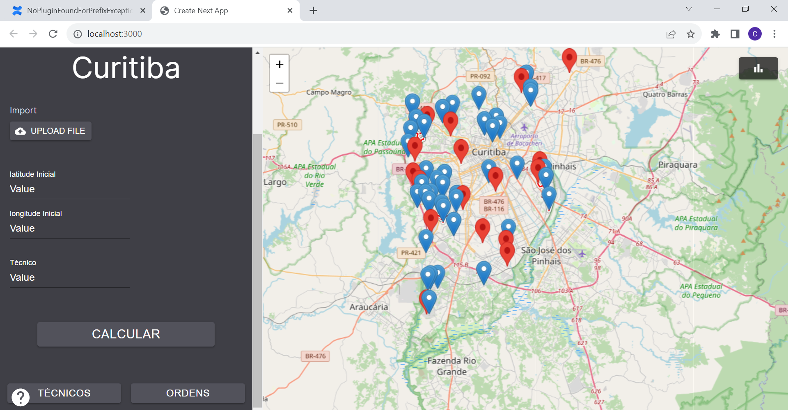

*Sprint 2*
# Documentação dos testes
Nesse arquivo documentaremos os testes, declarando o input recebido pelo algoritmo, mas também o output retornado pelo algoritmo.

No input recebemos o número de ordens e número de funcionários desejados na versão inicial e simplificada do algoritmo geramos as posições(coordenadas cartesianas) de forma aleatória, porém posteriormente receberemos dados tabulares com a localização dos funcionários e das ordens

No Output retorna-se a posição de cada funcionário e as coordenadas das ordens eles devem executar.

**Teste 1:**
        input: ordens = 20
               funcionários = 8

    Output:
    Funcionário(211.4279980950381, 33.22504694584805): (73.00590880418024, 149.86731257379944); (40.25786584725643, 219.71621696453155); (16.799310923263878, 303.9682451217714);

    Funcionário (487.0725869807009, 54.8278033090311): (448.76447535827475, 119.59822986025696); (457.0656114096074, 195.86007591157917); (539.2459712008007, 225.00165884820785);

    Funcionário (427.21517876101905, 91.
    61872721726283): (591.1735310014008, 108.62432526327737); (593.1293406049673, 332.3661521293723); (559.4638889144157, 429.323950073521);

    Funcionário (362.41957520534106, 355.6881936353265): (390.79399438899543, 378.86801542565485); (409.0273618448289, 388.18602603943526); (252.8595711323718, 318.50555801631117);

    Funcionário (434.96432631893055, 369.00752837855777): (573.6003976907341, 515.6805008548877); (296.97273049008805, 534.3191939227892); (172.88180613228175, 555.7723721103166);

    Funcionário (556.2557409147715, 426.7085498007409): (158.30676264937145, 493.38878913498644); (43.683347588645674, 457.39306669778983); (12.096597175578427, 521.1093169320197);

    Funcionário (25.455073384651648, 431.94072334901426): (10.091230081418946, 340.56080478208156);

    Funcionário (456.0678233515155, 591.473871988723): (18.50967323409689, 593.2143824299092);

**Teste 2:**
    input: ordens = 30
               funcionários = 12

    Output:

    Funcionário (234.61752307575037, 6.1248534480906835): (314.4887027326614, 22.479181337861043); (378.91955701280125, 35.3410427524319); (474.98385292779074, 17.213298527371347); 

    Funcionário (581.4352966259869, 20.066860218312744): (594.0168256123651, 35.04759527725654); (536.3755162691859, 179.83175701878545); (464.8023369890073, 173.28730600455552); 

    Funcionário (162.79580986225756, 20.413419859350057): (160.80949125156144, 127.30576816250488); (100.11027390817537, 234.39985080492355); (121.22202401558285, 262.7607046988514); 

    Funcionário (211.29669372760205, 97.85897762472185): (262.6138824933265, 210.9997751640129); (262.62912674020447, 266.9715230462775); (268.5972180238277, 333.07895155017405);

    Funcionário (465.5411536049346, 125.4529008327551): (400.8854455802395, 341.410331432572); (442.89843266030556, 352.89401309711553); (526.2749566500306, 381.62431388289366);

    Funcionário (3.302307723515918, 127.99575903398346): (8.83144204965911, 51.147983959218244); (190.78229231383318, 247.88598052468336); (285.50510699826333, 359.03755558708156);

    Funcionário (547.584742728611, 128.5022145750132): (338.36126077496505, 391.2751536620391); (242.98372218774605, 384.614998808653); (291.8975569325285, 524.662993688132);

    Funcionário (289.52052326224225, 170.34090107018562): (79.10211384222382, 351.8500821461843); (94.59485272324682, 425.8846618806902); (101.05274986836214, 432.07058721803025);

    Funcionário (257.8375790811601, 247.19609285986152): (355.62981635082986, 524.444019670203); (270.49002462401546, 551.895522081317); (129.53449281675674, 516.4052888128592);

    Funcionário (319.0707596843468, 306.2207617311432): (523.3400333512516, 568.695272665252); (33.997583171138615, 582.3966508264515);

    Funcionário (154.0392626488632, 327.93828390946203):

    Funcionário (385.21746924269587, 506.72133135848014): (3.2709342500441663, 500.97127603308047);

**Teste 3:**
    input: ordens = 25
               funcionários = 14

    Output:

    Funcionário (194.31051997480233, 2.0213166215378386): (265.54673033406453, 89.74066394429539); (312.05153556397414, 75.490741508695); (417.3281149425401, 96.44572723678833);

    Funcionário (365.9645230846337, 38.027358616346675): (509.87607436072994, 28.57698864052867); (517.9342439949058, 1.5991336545449153); (505.2406261518819, 144.7400961779735);

    Funcionário (557.1699658350889, 173.98117662498686): (585.5979445891794, 351.0710086403005); (587.1643379838933, 415.7189508637441); (526.6829281784735, 447.18985849965674);

    Funcionário (165.63191149256372, 234.6469810704482): (192.51912257687854, 270.21348895933664); (235.60703747540552, 332.15641564437084); (258.2831945710303, 332.80284538389407);

    Funcionário (36.694793979787896, 262.88961120681563): (38.74492123696167, 328.47006912748213); (88.41292163704395, 204.17910867741662); (142.0648148441149, 134.82751612435985);

    Funcionário (275.58802704295147, 296.9538658584005): (325.1144334484448, 254.6054837359173); (339.24434879333074, 281.36308008715866); (379.2782351063145, 305.9800878318485);

    Funcionário (387.136069235994, 364.44667064859925): (419.41450507823026, 370.0135644646309); (324.8814950533868, 364.6375538907761); (225.92966516710214, 440.7064263301666);

    Funcionário (534.1932577468111, 478.85083700010125): (496.93509580429975, 523.3693333319693); (359.2877268014843, 578.3315817306415); (47.0553874311987, 520.8985077724731);

    Funcionário (261.643820515837, 515.1310656913838):

    Funcionário (580.2422520254092, 516.9562541192735):

    Funcionário (309.1681356186185, 531.2051464224317):

    Funcionário (390.9358621377157, 532.1304614343121):

    Funcionário (218.02070889850654, 569.6912634981489):

    Funcionário (461.84915027440155, 596.77369717087): (102.69795062877876, 84.66111687816735);

**Teste 4:**
    input: ordens = 100
               funcionários = 28
    output:

    Funcionário (560.5504173163905, 3.6362904929112316): (504.5209863907618, 63.49748239610857); (530.9360366056039, 85.17345191668898); (528.4262972558857, 111.70001943359242);

    Funcionário (391.42093208064887, 15.722590430150252): (421.54384237791186, 0.7512316075050318); (422.65768445681437, 32.93639058498956); (412.32233610130106, 53.19488385929632);

    Funcionário (222.91507149665887, 25.179862630082784): (232.03340441324394, 25.19730593264409); (239.89307669857746, 12.55537270331466); (246.73889986937968, 21.998531864543637);

    Funcionário (498.9342252960936, 53.022061058159096): (478.3812387380196, 35.41586943877157); (456.70012461286564, 79.72221669314872); (484.0870098577517, 123.3089313384327);

    Funcionário (333.1433203524239, 63.504695085704824): (334.9121543666847, 53.21883708012154); (335.30640732266806, 76.37082327529419); (346.35784408213954, 74.62110785330367);

    Funcionário (373.57347231863804, 129.45613131744008): (377.2475829344699, 152.8059295887669); (379.69850163794274, 163.55591564251247); (393.5511126710092, 183.8727882981413);

    Funcionário (44.032670716033536, 140.98805147612268): (44.823710288075105, 150.60169840264373); (21.428229844563408, 118.33777170352715); (87.16898429626593, 149.3898811719808);

    Funcionário (581.286114974026, 201.20679861972735): (529.7710282933056, 210.782969945129); (484.0579650669873, 263.29583027481516); (479.35635838206485, 290.93684854094647);

    Funcionário (155.22228095662442, 276.7677276661828): (187.18750843784684, 251.71775407238803); (117.84638808339814, 252.73495411068356); (97.96445225257348, 282.3274160273335);

    Funcionário (181.68076836678904, 283.3010109948434): (171.72997939672678, 328.29059303704753); (147.1404542997783, 366.7924211378068); (155.70035592548473, 410.3826282196858);

    Funcionário (179.7142350742385, 307.0714363836257): (229.80339657446967, 317.4101380145751); (295.1708290981803, 365.3655783021852); (275.097905100848, 445.51533850511845);

    Funcionário (61.09151308519394, 316.57364801651784): (53.79136938780555, 282.999875299477); (96.02109256562939, 292.35358509335316); (43.443604509809845, 238.8022151086996);

    Funcionário (286.844102118929, 324.4714370715991): (189.4977877126516, 396.2093419554436); (196.45432743504918, 415.7586287201591); (151.32165011167714, 430.6047956769386);

    Funcionário (124.6030358318507, 333.63329489791056): (121.83663777213131, 403.82096064533397); (122.59578257128656, 468.10873338019115); (140.6282408704502, 474.76896021256664);

    Funcionário (434.5922499995821, 348.9152282266601): (422.00474161221615, 339.3015628308112); (465.15813113296906, 328.43994793377374); (474.75995623771036, 331.29684912374256);

    Funcionário (229.82099603863006, 354.5394799701128): (185.78023840670016, 484.64382676788347); (163.67163235749047, 486.675178434674); (157.96195617770067, 502.5222140832329);

    Funcionário (99.6873149165521, 406.2871344649263): (76.40141827187486, 475.10241125744255); (76.14313048701003, 479.39086225092177); (59.22811720698164, 483.9233662322036);

    Funcionário (98.49883135181592, 421.89272685253746): (106.2077804728311, 501.65866868185964); (87.81801380788875, 518.0353445970103); (29.092550188249035, 482.96146791655553);

    Funcionário (294.3579224295157, 441.92104568653326): (300.863602139787, 481.74894763513714); (342.51582923097817, 485.1862695421107); (354.9908416418405, 513.5144262739652);

    Funcionário (232.25962186047704, 443.6227036616649): (236.6503117281223, 527.3979765852037); (291.2285597493136, 534.9531875573117); (314.1514340111562, 591.6096243911481);

    Funcionário (573.8066855516956, 449.75865018753854): (566.8631786219825, 457.9366471836127); (538.3160382742311, 443.8401332945622); (515.2123183123316, 459.38766875585924);

    Funcionário (572.3192925781708, 451.8448208475346): (599.3811697904725, 466.70442925479057); (594.5903789031167, 488.0033056318055); (537.8889966560231, 497.4462639751988);

    Funcionário (549.291778425085, 457.32910607882076): (579.8772282043448, 411.9848553591203); (567.8572529494028, 350.52877654055436); (503.3947468313598, 357.9858720067648);

    Funcionário (175.05939385859938, 464.8700798794889): (10.613992209909885, 440.9843661113027); (10.46935720322011, 360.9992213196158); (22.89757220622606, 332.1874943022387);

    Funcionário (305.03730120065353, 465.6429460312105): (401.2779499868119, 414.3317341042661); (395.04337625889315, 542.029688164638); (381.7613629831243, 558.8863830157677);

    Funcionário (590.8388460217702, 479.44834484999086): (497.9349231224714, 525.8622198517778); (529.0964050412, 590.825503428137); (554.0198854908178, 588.4368871995018);
    
    Funcionário (362.5417467050518, 580.0076020286259): (496.3299126023486, 305.51336523041164); (434.8787153075967, 260.23697389743916); (426.44890085786443, 247.3596169104809);
    
    Funcionário (455.14108326637285, 585.5718301584448): (36.262242930099184, 588.7280293181286); (14.147340398101061, 583.3440084368266); (213.51467070777562, 182.48933511517455); (253.44368718632907, 24.58674341941589); (214.5091661567888, 34.63074006116447); (87.64914024633235, 41.87745349812455); (99.23608703560356, 42.53905526670165); (241.93711668418683, 43.452917275689494); (228.06027680566697, 84.23855042522877); (352.3717288446933, 85.32771224396099); (131.69531001187963, 87.45391367880512); (239.07071113791054, 99.85025689951073); (120.67241443888499, 101.74336402741262); (197.58604264823788, 110.99044524218502); (111.89209021226002, 112.73772839089756); (399.70061775249155, 112.987059748673); (264.6122260100695, 133.78941171279163); (134.01187821971797, 144.4986335132414); (198.1032554129663, 148.13735836130883);

*Sprint 3*

# Documentação do teste
Nessa seção faremos o teste do algoritmo e será mostrado  a resposta e a visualização dessa resposta. Note que o input do algoritmo foi alterado, atualmente o input é um array de json onde cada json tem a latitude,latitude,isfunc(que indica se é funcionário ou ordem) e id.

**Teste:**

Input:
    [
    {
        "longitude": -39.63905039426646,
        "latitude": 84.30814706593299,
        "isFuncionario": false,
        "id": 0
    },
    {
        "longitude": -88.50470433749312,
        "latitude": 84.39993835426205,
        "isFuncionario": false,
        "id": 1
    },
    {
        "longitude": 113.59508348717611,
        "latitude": -84.30386761740698,
        "isFuncionario": false,
        "id": 2
    },
    {
        "longitude": 112.06975399032825,
        "latitude": 53.838094856683824,
        "isFuncionario": true,
        "id": 3
    },
    {
        "longitude": -145.86383474919694,
        "latitude": 13.28514280107882,
        "isFuncionario": false,
        "id": 4
    },
    {
        "longitude": -111.7698958757643,
        "latitude": -8.537161359829327,
        "isFuncionario": true,
        "id": 5
    },
    {
        "longitude": -57.67503402173689,
        "latitude": -80.99054439397557,
        "isFuncionario": true,
        "id": 6
    },
    {
        "longitude": -44.32081926966154,
        "latitude": -12.088969742672631,
        "isFuncionario": false,
        "id": 7
    },
    {
        "longitude": -46.233651105646516,
        "latitude": -29.66200079559347,
        "isFuncionario": true,
        "id": 8
    },
    {
        "longitude": 145.8517467428893,
        "latitude": -21.568450141590432,
        "isFuncionario": false,
        "id": 9
    },
    {
        "longitude": -40.375665220869706,
        "latitude": -30.67065390682653,
        "isFuncionario": true,
        "id": 10
    },
    {
        "longitude": -44.61119674595909,
        "latitude": 79.67847519564955,
        "isFuncionario": true,
        "id": 11
    },
    {
        "longitude": 69.77797681171256,
        "latitude": -80.12060589555676,
        "isFuncionario": false,
        "id": 12
    },
    {
        "longitude": -124.33224244877539,
        "latitude": 54.072205606272234,
        "isFuncionario": false,
        "id": 13
    },
    {
        "longitude": -159.11770383708742,
        "latitude": 35.03912724187177,
        "isFuncionario": true,
        "id": 14
    },
    {
        "longitude": -125.08202084083607,
        "latitude": -4.095042755569494,
        "isFuncionario": true,
        "id": 15
    },
    {
        "longitude": -43.28075100468325,
        "latitude": -43.784092438515486,
        "isFuncionario": true,
        "id": 16
    },
    {
        "longitude": 76.48732474995211,
        "latitude": -78.51831083715841,
        "isFuncionario": true,
        "id": 17
    },
    {
        "longitude": -61.348822489620915,
        "latitude": 68.54856411743091,
        "isFuncionario": false,
        "id": 18
    },
    {
        "longitude": 96.542387298797,
        "latitude": -4.563964836610722,
        "isFuncionario": true,
        "id": 19
    },
    {
        "longitude": -58.2384654470234,
        "latitude": -71.7108803781724,
        "isFuncionario": false,
        "id": 20
    },
    {
        "longitude": 136.2134823950181,
        "latitude": -61.04176991329547,
        "isFuncionario": false,
        "id": 21
    },
    {
        "longitude": 47.67781504304904,
        "latitude": -7.644840212283384,
        "isFuncionario": false,
        "id": 22
    },
    {
        "longitude": -82.71678388138096,
        "latitude": 3.076498833485388,
        "isFuncionario": false,
        "id": 23
    },
    {
        "longitude": 49.93768343181054,
        "latitude": 59.707062503959946,
        "isFuncionario": false,
        "id": 24
    },
    {
        "longitude": 151.35485683586865,
        "latitude": 11.266492260214491,
        "isFuncionario": false,
        "id": 25
    },
    ];

Output:

Visualização geográfica(pontos vermelhos são funcionários e pontos azuis são ordens):

Resultado da Função objetivo(calculando o somatório da distância euclidiana): 933.3023253712718

Alocação de ordens para cada funcionário:

    Funcionário (35.03912724187177, -159.11770383708742): (13.28514280107882, -145.86383474919694); (54.072205606272234, -124.33224244877539); (84.39993835426205, -88.50470433749312);

    Funcionário (-4.095042755569494, -125.08202084083607): (3.076498833485388, -82.71678388138096); (-12.088969742672631, -44.32081926966154); (-71.7108803781724, -58.2384654470234);

    Funcionário (-8.537161359829327, -111.7698958757643): (68.54856411743091, -61.348822489620915); (84.30814706593299, -39.63905039426646); (59.707062503959946, 49.93768343181054);

    Funcionário (-80.99054439397557, -57.67503402173689): (-80.12060589555676, 69.77797681171256); (-84.30386761740698, 113.59508348717611); (-61.04176991329547, 136.213482)

    Funcionário (-29.66200079559347, -46.233651105646516): (-7.644840212283384, 47.67781504304)

    Funcionário (-29.66200079559347, -46.233651105646516): (-7.644840212283384, 47.67781504304904); (-21.568450141590432, 145.8517467428893);

    Funcionário (79.67847519564955, -44.61119674595909):

    Funcionário (-43.784092438515486, -43.28075100468325):

    Funcionário (-30.67065390682653, -40.375665220869706):

    Funcionário (-78.51831083715841, 76.48732474995211):

    Funcionário (-4.563964836610722, 96.542387298797):

    Funcionário (53.838094856683824, 112.06975399032825): (11.266492260214491, 151.35485683586865);

*Sprint 4*

Durante a Sprint 4, fizemos a integração do front-end e back-end da nossa aplicação web. Com isso, temos que fazer os testes da aplicação para garantir o funcionamento do sistema.

## Cenários essenciais

### Upload do CSV
Nesta parte, o usuário deveria conseguir fazer o upload de um documento CSV.

Figura 01: Upload File.

Figura 02: Selecionando arquivo.

Figura 03: Sucesso na seleção de arquivo.

### Calcular as rotas
Quando o usuário apertar no botão 'Calcular', o arquivo CSV deve ser passado para o back-end para o cálculo das rotas.

Figura 04: Botão 'Calcular'.

Ao apertar o botão, o arquivo será passado para o back-end e podemos ver isso no Inspecionar.

Figura 05: Visualização do Inspecionar da página.

Se formos no VS Code, podemos ver o resultado gerado pelo algoritmo.

Figura 06: Visualização do VS Code.

### Expor no mapa o resultado
Quando o resultado for gerado pelo algoritmo, as rotas serão expostas no mapa.

Mapa antes do resultado o algoritmo:

Figura 07: Página principal.

Mapa depois do resultado do algoritmo:

Figura 08: Mapa depois do cálculo das rotas.

Se formos no Inspecionar da página, poderemos visualizar esse processo:

Figura 09: Visualização do processo no Inspecionar.

### Visualizar tabela de técnicos
Se o usuário apertar no botão 'Técnicos', será possível ver uma tabela com as informações dos técnicos.

Figura 10: Visualização da tabela de técnicos.

### Visualizar tabela de ordens
Se o usuário apertar no botão 'Ordens', será possível ver uma tabela com as informações das ordens.

Figura 11: Visualização da tabela de ordens.

### Exportar resultado em CSV
Se o usuário clicar no botão de exportar, será possível exportar o resultados das rotas em um documento CSV.

Figura 12: Visualização do documento CSV salvo no notebook.

Figura 13: Visualização do documento CSV.

## Resultados

O resultado dos testes da nossa aplicação foram bem sucedidos. Todos os componentes estão funcionando corretamente e o algoritmo forneceu o resultado esperado para o teste.

A seguir está o documento CSV que usamos para teste:

| id  | identifier | isFuncionario | latitude    | longitude   | periodo |
|----:|------------|---------------|-------------|-------------|---------|
| 0   | 0          | true          | -25.454522  | -49.214732  |         |
| 92  | 0          | false         | -25.40974   | -49.263218  | manha   |
| 93  | 0          | true          | -25.465331  | -49.356244  |         |
| 94  | 0          | true          | -25.472855  | -49.349405  |         |
| 95  | 0          | false         | -25.488097  | -49.307343  | manha   |
| 96  | 0          | false         | -25.493355  | -49.338084  | manha   |
| 97  | 0          | false         | -25.486857  | -49.351547  | tarde   |
| 98  | 0          | false         | -25.486608  | -49.342662  | tarde   |
| 99  | 0          | true          | -25.462166  | -49.216642  |         |
| 100 | 0          | false         | -25.469933  | -49.207462  | manha   |
| 101 | 0          | true          | -25.44364   | -49.20426   |         |
| 102 | 0          | false         | -25.457932  | -49.240261  | tarde   |
| 103 | 0          | false         | -25.460974  | -49.209919  | tarde   |
| 104 | 0          | false         | -25.488933  | -49.204401  | manha   |
| 105 | 0          | true          | -25.469814  | -49.264201  |         |
| 106 | 0          | false         | -25.4619    | -49.271962  | manha   |
| 107 | 0          | true          | -25.442031  | -49.302809  |         |
| 108 | 0          | false         | -25.420591  | -49.267656  | manha   |
| 109 | 0          | true          | -25.369934  | -49.235474  |         |
| 110 | 0          | false         | -25.395735  | -49.356732  | manha   |
| 111 | 0          | false         | -25.466917  | -49.321364  | tarde   |
| 112 | 0          | true          | -25.47738   | -49.2881    |         |
| 113 | 0          | false         | -25.476947  | -49.346604  | tarde   |
| 114 | 0          | false         | -25.515327  | -49.311085  | manha   |
| 115 | 0          | false         | -25.491534  | -49.308191  | tarde   |
| 116 | 0          | true          | -25.414072  | -49.314387  |         |
| 117 | 0          | false         | -25.413465  | -49.2763    | manha   |
| 118 | 0          | false         | -25.41696   | -49.259096  | tarde   |
| 119 | 0          | false         | -25.387909  | -49.282272  | tarde   |
| 120 | 0          | true          | -25.522069  | -49.278157  |         |
| 121 | 0          | false         | -25.380845  | -49.225238  | tarde   |
| 122 | 0          | false         | -25.384059  | -49.22481   | manha   |
| 123 | 0          | false         | -25.366606  | -49.229418  | tarde   |
| 124 | 0          | true          | -25.593597  | -49.341276  |         |
| 125 | 0          | false         | -25.532256  | -49.341512  | tarde   |
| 126 | 0          | false         | -25.569354  | -49.336994  | manha   |
| 127 | 0          | true          | -25.350395  | -49.181745  |         |
| 128 | 0          | true          | -25.43929   | -49.354028  |         |
| 129 | 0          | false         | -25.436068  | -49.361828  | manha   |
| 130 | 0          | false         | -25.415848  | -49.34406   | manha   |
| 131 | 0          | false         | -25.422214  | -49.358631  | tarde   |
| 132 | 0          | false         | -25.40125   | -49.32333   | manha   |
| 133 | 0          | true          | -25.533953  | -49.252558  |         |
| 134 | 0          | false         | -25.568477  | -49.328449  | tarde   |
| 135 | 0          | false         | -25.593854  | -49.33808   | manha   |
| 136 | 0          | false         | -25.570215  | -49.339771  | tarde   |
| 137 | 0          | true          | -25.48853   | -49.30016   |         |
| 138 | 0          | false         | -25.497482  | -49.324566  | manha   |
| 139 | 0          | false         | -25.477299  | -49.323389  | tarde   |
| 140 | 0          | true          | -25.51295   | -49.33599   |         |
| 141 | 0          | false         | -25.500993  | -49.322629  | manha   |
| 142 | 0          | false         | -25.486017  | -49.336088  | tarde   |
| 143 | 0          | false         | -25.472643  | -49.329455  | tarde   |
| 144 | 0          | true          | -25.545382  | -49.251345  |         |
| 145 | 0          | false         | -25.521864  | -49.24962   | tarde   |
| 146 | 0          | false         | -25.564707  | -49.277383  | manha   |
| 147 | 0          | true          | -25.408425  | -49.340605  |         |
| 148 | 0          | false         | -25.411162  | -49.352686  | manha   |
| 149 | 0          | false         | -25.396879  | -49.312348  | tarde   |
| 150 | 0          | false         | -25.462911  | -49.341591  | manha   |

O documento também pode ser visualizado no seguinte caminho: artefatos\docs\Teste_Oficial.csv

A seguir está o documento CSV com o resultado do cálculo das rotas:

| DemandaId | DemandaLatitude | DemandaLongitude | IsFuncionario | Periodo | IdentifierDemanda |
|-----------|-----------------|-------------------|----------------|---------|-------------------|
| 123       | -25.366606      | -49.229418        | false          | tarde   | 0                 |
| 121       | -25.380845      | -49.225238        | false          | tarde   | 0                 |
| 119       | -25.387909      | -49.282272        | false          | tarde   | 0                 |

| DemandaId | DemandaLatitude | DemandaLongitude | IsFuncionario | Periodo | IdentifierDemanda |
|-----------|-----------------|-------------------|----------------|---------|-------------------|
| 114       | -25.515327      | -49.311085        | false          | manha   | 0                 |
| 139       | -25.477299      | -49.323389        | false          | tarde   | 0                 |
| 125       | -25.532256      | -49.341512        | false          | tarde   | 0                 |

| DemandaId | DemandaLatitude | DemandaLongitude | IsFuncionario | Periodo | IdentifierDemanda |
|-----------|-----------------|-------------------|----------------|---------|-------------------|
| 117       | -25.413465      | -49.2763          | false          | manha   | 0                 |
| 108       | -25.420591      | -49.267656        | false          | manha   | 0                 |
| 102       | -25.457932      | -49.240261        | false          | tarde   | 0                 |

| DemandaId | DemandaLatitude | DemandaLongitude | IsFuncionario | Periodo | IdentifierDemanda |
|-----------|-----------------|-------------------|----------------|---------|-------------------|
| 132       | -25.40125       | -49.32333         | false          | manha   | 0                 |
| 110       | -25.395735      | -49.356732        | false          | manha   | 0                 |
| 149       | -25.396879      | -49.312348        | false          | tarde   | 0                 |

| DemandaId | DemandaLatitude | DemandaLongitude | IsFuncionario | Periodo | IdentifierDemanda |
|-----------|-----------------|-------------------|----------------|---------|-------------------|
| 146       | -25.564707      | -49.277383        | false          | manha   | 0                 |
| 134       | -25.568477      | -49.328449        | false          | tarde   | 0                 |

| DemandaId | DemandaLatitude | DemandaLongitude | IsFuncionario | Periodo | IdentifierDemanda |
|-----------|-----------------|-------------------|----------------|---------|-------------------|
| 122       | -25.384059      | -49.22481         | false          | manha   | 0                 |
| 92        | -25.40974       | -49.263218        | false          | manha   | 0                 |
| 118       | -25.41696       | -49.259096        | false          | tarde   | 0                 |

| DemandaId | DemandaLatitude | DemandaLongitude | IsFuncionario | Periodo | IdentifierDemanda |
|-----------|-----------------|-------------------|----------------|---------|-------------------|
| 95        | -25.488097      | -49.307343        | false          | manha   | 0                 |
| 141       | -25.500993      | -49.322629        | false          | manha   | 0                 |
| 115       | -25.491534      | -49.308191        | false          | tarde   | 0                 |

| DemandaId | DemandaLatitude | DemandaLongitude | IsFuncionario | Periodo | IdentifierDemanda |
|-----------|-----------------|-------------------|----------------|---------|-------------------|
| 96        | -25.493355      | -49.338084        | false          | manha   | 0                 |
| 138       | -25.497482      | -49.324566        | false          | manha   | 0                 |
| 142       | -25.486017      | -49.336088        | false          | tarde   | 0                 |

| DemandaId | DemandaLatitude | DemandaLongitude | IsFuncionario | Periodo | IdentifierDemanda |
|-----------|-----------------|-------------------|----------------|---------|-------------------|
| 148       | -25.411162      | -49.352686        | false          | manha   | 0                 |
| 130       | -25.415848      | -49.34406         | false          | manha   | 0                 |
| 131       | -25.422214      | -49.358631        | false          | tarde   | 0                 |

| DemandaId | DemandaLatitude | DemandaLongitude | IsFuncionario | Periodo | IdentifierDemanda |
|-----------|-----------------|-------------------|----------------|---------|-------------------|
| 150       | -25.462911      | -49.341591        | false          | manha   | 0                 |
| 111       | -25.466917      | -49.321364        | false          | tarde   | 0                 |
| 143       | -25.472643      | -49.329455        | false          | tarde   | 0                 |

| DemandaId | DemandaLatitude | DemandaLongitude | IsFuncionario | Periodo | IdentifierDemanda |
|-----------|-----------------|-------------------|----------------|---------|-------------------|
| 135       | -25.593854      | -49.33808         | false          | manha   | 0                 |
| 126       | -25.569354      | -49.336994        | false          | manha   | 0                 |
| 136       | -25.570215      | -49.339771        | false          | tarde   | 0                 |

| DemandaId | DemandaLatitude | DemandaLongitude | IsFuncionario | Periodo | IdentifierDemanda |
|-----------|-----------------|-------------------|----------------|---------|-------------------|
| 100       | -25.469933      | -49.207462        | false          | manha   | 0                 |
| 104       | -25.488933      | -49.204401        | false          | manha   | 0                 |

| DemandaId | DemandaLatitude | DemandaLongitude | IsFuncionario | Periodo | IdentifierDemanda |
|-----------|-----------------|-------------------|----------------|---------|-------------------|
| 113       | -25.476947      | -49.346604        | false          | tarde   | 0                 |
| 97        | -25.486857      | -49.351547        | false          | tarde   | 0                 |
| 98        | -25.486608      | -49.342662        | false          | tarde   | 0                 |

| DemandaId | DemandaLatitude | DemandaLongitude | IsFuncionario | Periodo | IdentifierDemanda |
|-----------|-----------------|-------------------|----------------|---------|-------------------|
| 145       | -25.521864      | -49.24962         | false          | tarde   | 0                 |

| DemandaId | DemandaLatitude | DemandaLongitude | IsFuncionario | Periodo | IdentifierDemanda |
|-----------|-----------------|-------------------|----------------|---------|-------------------|
| 106       | -25.4619        | -49.271962        | false          | manha   | 0                 |

| DemandaId | DemandaLatitude | DemandaLongitude | IsFuncionario | Periodo | IdentifierDemanda |
|-----------|-----------------|-------------------|----------------|---------|-------------------|
| 103       | -25.460974      | -49.209919        | false          | tarde   | 0                 |

| DemandaId | DemandaLatitude | DemandaLongitude | IsFuncionario | Periodo | IdentifierDemanda |
|-----------|-----------------|-------------------|----------------|---------|-------------------|
| 129       | -25.436068      | -49.361828        | false          | manha   | 0                 |

O documento também pode ser visualizado completamente no seguinte caminho: artefatos\docs\Resultado_Rotas.csv
